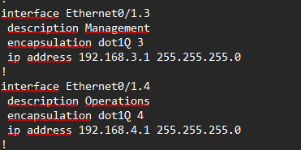

#Настройка VLAN

Цель:
Настройка DTP.
Добавление сетей VLAN и назначение портов.

Схема лабараторного стенда в EVE-NG

Исходные данные в draw.io

Решение

Настраиваем  Vlan и Access порты на коммутатора, пример:

Также настраиваем остальные Vlan.
Настраиваем транк порт между коммутаторами, а также в сторону маршрутизатора.

Настройки на маршрутизаторе

Пинг между ПК успешно

