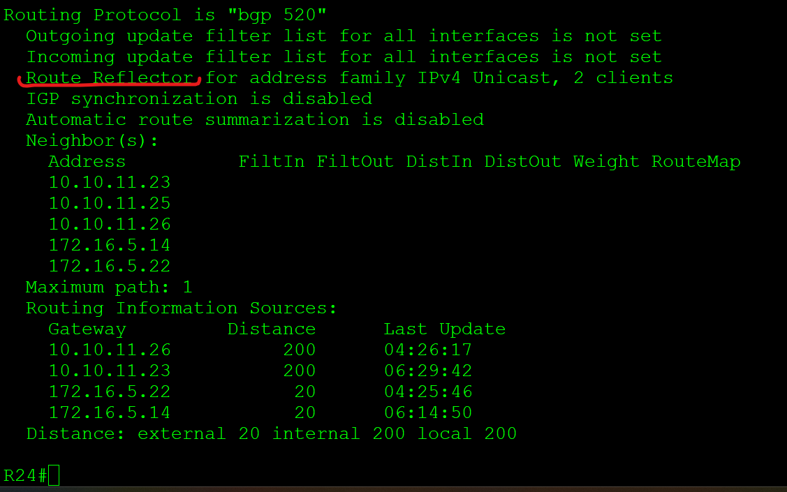
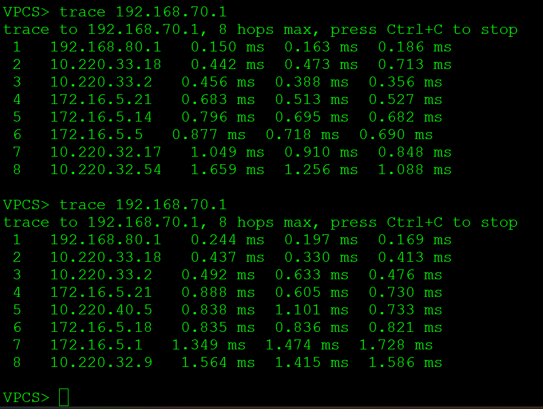
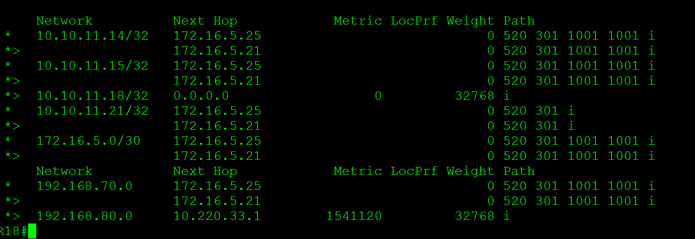
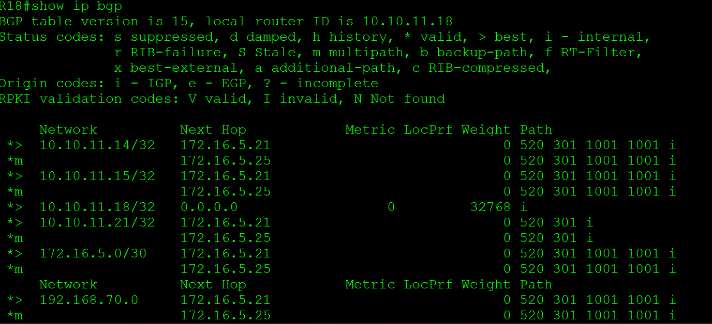

# **iBGP - Route-Reflector**
________________________________________________________
- Настроите iBGP в офисом Москва между маршрутизаторами R14 и R15.
- Настроите iBGP в провайдере Триада, с использованием RR.
- Настройте офиса Москва так, чтобы приоритетным провайдером стал Ламас.
- Настройте офиса С.-Петербург так, чтобы трафик до любого офиса распределялся по двум линкам одновременно.
- Все сети в лабораторной работе должны иметь IP связность.

&nbsp;&nbsp;&nbsp;&nbsp;&nbsp;&nbsp;&nbsp;&nbsp;&nbsp;&nbsp;&nbsp;&nbsp;&nbsp;&nbsp;&nbsp;&nbsp;&nbsp;&nbsp;&nbsp;&nbsp;
 
1. Настраиваем R14 R15, самая распространённая практика это  IBGP-партнёрство между Loopback-адресами. Делается это для того, чтобы не привязываться к физическим интерфейсам — в случае падения основного линка, BGP-сессия не прервётся, потому что лупбэк будет доступен через резервный.
Второй момент- меняем адрес Next-Hop при передаче IBGP-соседям, иначе поскольку iBGP маршрутизатор передаёт анонс IBGP-соседу не меняя Next-Hop, мы не сможем найти в своей таблице маршрутизации маршрут до Next-Hop выхода из AS.

R15
<pre><code>router bgp 1001
bgp router-id 10.10.11.15
neighbor 10.10.11.14 remote-as 1001
neighbor 10.10.11.14 update-source Loopback0
neighbor 10.10.11.14 next-hop-self</code></pre>

2. Настраиваем Triada.RR выбираем R24
R24
<pre><code>router bgp 520
 bgp router-id 10.10.11.24
 network 10.10.11.24
 neighbor TRIADA peer-group
 neighbor TRIADA remote-as 520
 neighbor TRIADA update-source Loopback0
 neighbor TRIADA route-reflector-client
 neighbor TRIADA next-hop-self
 neighbor 10.10.11.23 peer-group TRIADA
 neighbor 10.10.11.25 peer-group TRIADA
 neighbor 10.10.11.26 peer-group TRIADA</code></pre>
 
остальные маршрутизаторы устанавливают обычное соседство IBGP только с R24

R25
<pre><code>router bgp 520
 bgp log-neighbor-changes
 neighbor 10.10.11.24 remote-as 520
 neighbor 10.10.11.24 update-source Loopback0
 neighbor 10.10.11.24 next-hop-self</code></pre>

Такая схема рабочая, но не отказоустойчивая, поскольку при отключении R24 не будет связи между всеми офисами. Поэтому добавляем в качестве RR R23.

Для этого R25 и R26 устанавливают соседство еще и с R23, окончательно это выглядит на R25

<pre><code>R25#show run | s r b
router bgp 520
 bgp log-neighbor-changes
 neighbor 10.10.11.23 remote-as 520
 neighbor 10.10.11.23 update-source Loopback0
 neighbor 10.10.11.23 next-hop-self
 neighbor 10.10.11.24 remote-as 520
 neighbor 10.10.11.24 update-source Loopback0
 neighbor 10.10.11.24 next-hop-self</code></pre>

на RR конфигурация на примере R23

<pre><code>R23#show running-config | s r b
router bgp 520
 bgp log-neighbor-changes
 neighbor TRIADA peer-group
 neighbor TRIADA remote-as 520
 neighbor TRIADA update-source Loopback0
 neighbor TRIADA route-reflector-client
 neighbor TRIADA next-hop-self
 neighbor 10.10.11.24 remote-as 520
 neighbor 10.10.11.24 update-source Loopback0
 neighbor 10.10.11.24 next-hop-self
 neighbor 10.10.11.25 peer-group TRIADA
 neighbor 10.10.11.26 peer-group TRIADA
 neighbor 172.16.5.18 remote-as 101</code></pre>

теперь проверяем при помощи команд <pre><code>show ip protocols</code></pre>на R23 R24

видим, что оба чувствуют себя Route Reflector

3. Чтобы приоритетным провайдером стал Ламас будем использовать атрибуты.
* для направления входящего трафика - Local Preference. При этом, более высокое значение устанавливаем на предпочтительного провайдера- Ламас.
- для направления исходящего трафика в нужную сторону будем анонсировать префиксы искусственно удлинив значение атрибута AS-PATH

создадим  Rout-map на входящий и исходящий трафик

R14

<pre><code>route-map AS_101_out permit 10
 set as-path prepend 1001 1001 1001 1001 1001
!
route-map AS101_IN permit 10
 set local-preference 500</code></pre>

R15

<pre><code>route-map AS_301_in permit 10
 set local-preference 800
!
route-map AS_301_out permit 10
 set as-path prepend 1001</code></pre>

вешаем эти Роутмап на соседа BGP
<pre><code>neighbor 172.16.5.6 route-map AS_301_in in
neighbor 172.16.5.6 route-map AS_301_out out</code></pre>
итоговая конфигурация BGP (для того чтобы обеспечитьсвязанность между офисами анонсируем сети VPC1 VPC7 192.168.70.0 и 192.168.10.0)

R15

<pre><code>router bgp 1001
 bgp router-id 10.10.11.15
 bgp log-neighbor-changes
 network 10.10.11.15 mask 255.255.255.255
 network 192.168.10.0
 network 192.168.70.0
 neighbor 10.10.11.14 remote-as 1001
 neighbor 10.10.11.14 update-source Loopback0
 neighbor 10.10.11.14 next-hop-self
 neighbor 172.16.5.6 remote-as 301
 neighbor 172.16.5.6 route-map AS_301_in in
 neighbor 172.16.5.6 route-map AS_301_out out</code></pre>

R14

<pre><code>R14#show running-config | s r b
router bgp 1001
 bgp router-id 10.10.11.14
 bgp log-neighbor-changes
 network 10.10.11.14 mask 255.255.255.255
 network 172.16.5.0 mask 255.255.255.252
 network 192.168.10.0
 network 192.168.70.0
 neighbor 10.10.11.15 remote-as 1001
 neighbor 10.10.11.15 update-source Loopback0
 neighbor 172.16.5.2 remote-as 101
 neighbor 172.16.5.2 route-map AS101_IN in
 neighbor 172.16.5.2 route-map AS_101_out out</code></pre>

проверяем - запуская трассировку с VPC8 VPC7 (Из СПБ в сторону Москвы и наоборот), меняя данные атрибуты, видим, трафик перенаправляется в нужную нам сторону.
 для применения политик необходимо после изменений делать мягкое или жестое обновление BGP на R14 R15
<pre><code> clear ip bgp * soft in

 clear ip bgp * soft out</code></pre>

4. Настраиваем распределение на R18

 разрешаем использовать несколько путей для маршрутов с одинаковым AS path. 
 <pre><code>bgp bestpath as-path multipath-relax </code></pre>

 По умолчанию BGP выбирает один лучший путь из возможных равнозначных, полученных от разных провайдеров. Команда maximum-paths меняет это поведение, позволяя использовать несколько путей для одного назначения. 

 <pre><code>maximum-paths 2 </code></pre> 

таблица маршрутизации до настроек

после настройки Multipath

5.

 [конфигурация узлов](conf/)