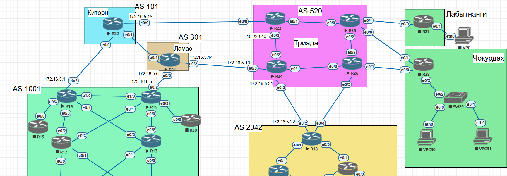
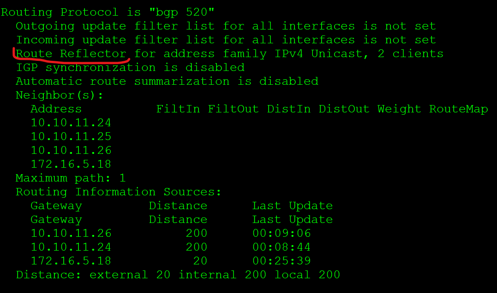

# **iBGP - Route-Reflector**
________________________________________________________
- Настроите iBGP в офисом Москва между маршрутизаторами R14 и R15.
- Настроите iBGP в провайдере Триада, с использованием RR.
- Настройте офиса Москва так, чтобы приоритетным провайдером стал Ламас.
- Настройте офиса С.-Петербург так, чтобы трафик до любого офиса распределялся по двум линкам одновременно.
- Все сети в лабораторной работе должны иметь IP связность.

&nbsp;&nbsp;&nbsp;&nbsp;&nbsp;&nbsp;&nbsp;&nbsp;&nbsp;&nbsp;&nbsp;&nbsp;&nbsp;&nbsp;&nbsp;&nbsp;&nbsp;&nbsp;&nbsp;&nbsp;
 
1. Настраиваем R14 R15, самая распространённая практика это  IBGP-партнёрство между Loopback-адресами. Делается это для того, чтобы не привязываться к физическим интерфейсам — в случае падения основного линка, BGP-сессия не прервётся, потому что лупбэк будет доступен через резервный.
Второй момент- меняем адрес Next-Hop при передаче IBGP-соседям, иначе поскольку iBGP маршрутизатор передаёт анонс IBGP-соседу не меняя Next-Hop, мы не сможем найти в своей таблице маршрутизации маршрут до Next-Hop выхода из AS.

R15
<pre><code>router bgp 1001
bgp router-id 10.10.11.15
neighbor 10.10.11.14 remote-as 1001
neighbor 10.10.11.14 update-source Loopback0
neighbor 10.10.11.14 next-hop-self</code></pre>

2. Настраиваем Triada.RR выбираем R24
R24
<pre><code>router bgp 520
 bgp router-id 10.10.11.24
 network 10.10.11.24
 neighbor TRIADA peer-group
 neighbor TRIADA remote-as 520
 neighbor TRIADA update-source Loopback0
 neighbor TRIADA route-reflector-client
 neighbor TRIADA next-hop-self
 neighbor 10.10.11.23 peer-group TRIADA
 neighbor 10.10.11.25 peer-group TRIADA
 neighbor 10.10.11.26 peer-group TRIADA</code></pre>
 
остальные маршрутизаторы устанавливают обычное соседство IBGP только с R24

R25
<pre><code>router bgp 520
 bgp log-neighbor-changes
 neighbor 10.10.11.24 remote-as 520
 neighbor 10.10.11.24 update-source Loopback0
 neighbor 10.10.11.24 next-hop-self</code></pre>

Такая схема рабочая, но не отказоустойчивая, поскольку при отключении R24 не будет связи между всеми офисами. Поэтому добавляем в качестве RR R23.

Для этого R25 и R26 устанавливают соседство еще и с R23, окончательно это выглядит на R25

<pre><code>R25#show run | s r b
router bgp 520
 bgp log-neighbor-changes
 neighbor 10.10.11.23 remote-as 520
 neighbor 10.10.11.23 update-source Loopback0
 neighbor 10.10.11.23 next-hop-self
 neighbor 10.10.11.24 remote-as 520
 neighbor 10.10.11.24 update-source Loopback0
 neighbor 10.10.11.24 next-hop-self</code></pre>

на RR конфигурация на примере R23

<pre><code>R23#show running-config | s r b
router bgp 520
 bgp log-neighbor-changes
 neighbor TRIADA peer-group
 neighbor TRIADA remote-as 520
 neighbor TRIADA update-source Loopback0
 neighbor TRIADA route-reflector-client
 neighbor TRIADA next-hop-self
 neighbor 10.10.11.24 remote-as 520
 neighbor 10.10.11.24 update-source Loopback0
 neighbor 10.10.11.24 next-hop-self
 neighbor 10.10.11.25 peer-group TRIADA
 neighbor 10.10.11.26 peer-group TRIADA
 neighbor 172.16.5.18 remote-as 101</code></pre>

теперь проверяем при помощи команд <pre><code>show ip protocols</code></pre>

 [конфигурация узлов](conf/)