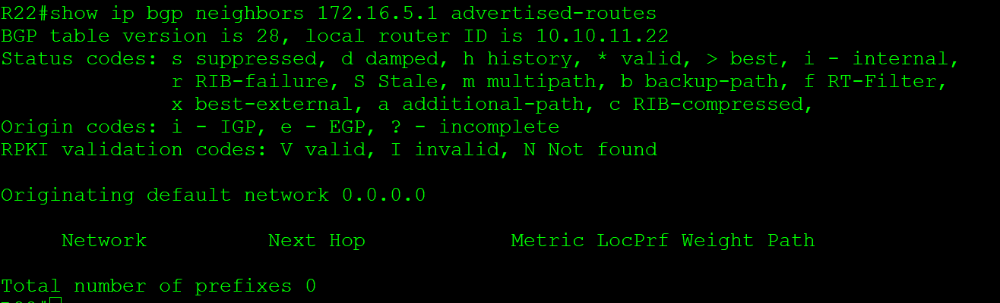

# **BGP. Фильтрация**
________________________________________________________
- Настроить фильтрацию в офисе Москва так, чтобы не появилось транзитного трафика(As-path).
- Настроить фильтрацию в офисе С.-Петербург так, чтобы не появилось транзитного трафика(Prefix-list).
- Настроить провайдера Киторн так, чтобы в офис Москва отдавался только маршрут по умолчанию.
- Настроить провайдера Ламас так, чтобы в офис Москва отдавался только маршрут по умолчанию и префикс офиса С.-Петербург.
Все сети в лабораторной работе должны иметь IP связность.
План работы и изменения зафиксированы в документации.

1. 
 Списки доступа AS_PATH читаются как обычные списки доступа (access-lists). Операторы читаются последовательно, и в конце есть неявный запрет. Вместо сопоставления адреса в каждом операторе, как в обычном списке доступа, списки доступа по атрибуту AS_PATH сопоставляются по так называемому регулярному выражению (regular expression). Регулярные выражения — это шаблоны, используемые для сопоставления последовательностей символов в строках. Укажем специальный тип access-list для сопоставления маршрутов BGP с атрибутом AS_PATH

<pre><code>ip as-path access-list 300 permit ^$</code></pre>
Регулярное выражение ^$ гарантирует, что будут рассылаться только локально созданные маршруты.
 

Применим настроенный access-list с помощью команды neighbor с параметром filter-list. Ключевое слово out указывает, что список применяется к информации маршрутизации, отправляемой этому соседу:

<pre><code> neighbor 172.16.5.2 filter-list 300 out</code></pre>

чтобы убедиться, что фильтр работает должным образом. Выполним команду show ip bgp regexp ^$:

[регулярные выражения](regular/)

2.
Используем префикс лист, где разрешим только сети VPC VPC8, Применим настроенный префикс лист на соседей.

<pre><code>ip prefix-list NO_TRANSIT seq 5 permit 192.168.80.0/24
ip prefix-list NO_TRANSIT seq 10 permit 192.168.0.0/24

neighbor 172.16.5.25 prefix-list NO_TRANSIT out</code></pre>

проверяем до фильтрации анонсируем

после применения фильтра на соседа

3.
Добавить default route в BGP можно 3-мя способами:
1) С помощью команды network
2) С помощью команды redistribute
3) С помощью команды neighbor [neighbor-id] default-originate [route-map route-map-name]

используем третий способ 

Если использовать neighbor [neighbor-id] default-originate [route-map route-map-name], то маршрут по умолчанию не создается в таблице BGP. Эта команда указывает, что конкретному соседу нужно отдавать маршрут по-умолчанию. Так же данный способ не проверяет, находится ли в таблице маршрутизации маршрут по-умолчанию. 
 Чтобы отдавалсь только маршрут по умолчанию отфильтруем все остальные маршруты при помощи префикс лист

 Создаем статический маршрут в null0

<pre><code>ip route 0.0.0.0 0.0.0.0 Null0</code></pre>

Создаем префикс лист

<pre><code>ip prefix-list Def-route seq 5 permit 0.0.0.0/0

route-map check-default permit 10
 match ip address prefix-list Def-route</code></pre>

Отдаем маршрут по умолчанию, применяем фильтр

<pre><code>neighbor 172.16.5.1 default-originate
 neighbor 172.16.5.1 route-map check-default out</code></pre>

проверяем - что мы анонсируем в сторну R14 c R22 до манипуляций

после примения default-originate

после примения фильтров на выход

4.
для решения задачи также как и в п.3 используем default-originate  на соседа + префикс лист где отфильтруем все кроме сети СПБ

<pre><code>
ip prefix-list Def-route seq 10 permit 192.168.80.0/24
ip prefix-list Def-route seq 20 permit 192.168.0.0/24
ip prefix-list Def-route seq 100 deny 0.0.0.0/0code>

route-map Check-default permit 10
 match ip address prefix-list Def-route

neighbor 172.16.5.5 default-originate
neighbor 172.16.5.5 route-map Check-default out
</pre>

проверяем анонсы с R21   в сторону R15

после примения default-originate + фильтры 

 [конфигурация узлов](conf/)

 [ip_route](ip_route/)