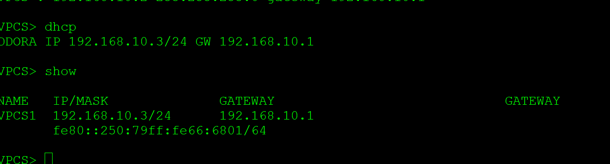
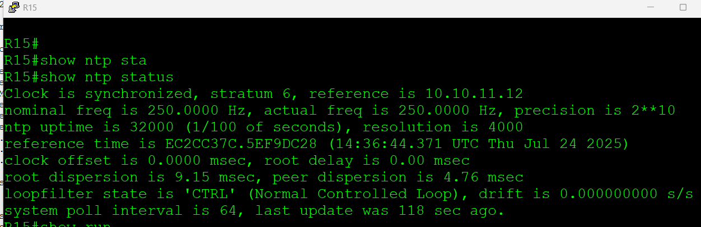

# **Основные протоколы сети интернет**
________________________________________________________
1. Настроите NAT(PAT) на R14 и R15. Трансляция должна осуществляться в адрес автономной системы AS1001.
2. Настроите NAT(PAT) на R18. Трансляция должна осуществляться в пул из 5 адресов автономной системы AS2042.
3. Настроите статический NAT для R20.
4. Настроите NAT так, чтобы R19 был доступен с любого узла для удаленного управления.

    5 *.  Настроите статический NAT(PAT) для офиса Чокурдах.
5. Настроите для IPv4 DHCP сервер в офисе Москва на маршрутизаторах R12 и R13. VPC1 и VPC7 должны получать сетевые настройки по DHCP.
6. Настроите NTP сервер на R12 и R13. Все устройства в офисе Москва должны синхронизировать время с R12 и R13.
7. Все офисы в лабораторной работе должны иметь IP связность.
8. План работы и изменения зафиксированы в документации.

1.
За границу МСК выдаем публичный адрес 135.135.135.1

объявляем пул Nat

```ip nat pool MSK с 135.135.135.1 netmask 255.255.255.252```

создадим акцесс лист, для сетей VPC1, VPC7

```access-list 1 permit 192.168.0.0 0.0.255.255```

сопостовляем пул нат со списком ACL 1. overload - говорит о PAT

```ip nat inside source list 1 pool MSK overload```

Все интерфейсы прописываем как внутренние
 ```ip nat inside```

 кроме внешнего порта для R14  и R15 это будет Ethernet0/2 на котором ставим 
  ```ip nat outside```

Чтобы работала связь между офисами, обявляем сеть 135.135.135.0 в BGP

``` network 135.135.135.0 mask 255.255.255.252```

проверяем работу нат, пингуем в сторону сети СПБ


проверяем по Wireshark


на R15


2. 
В пул для СПб добавляем 5 адресов с 136.136.136.1 по 136.136.136.5

```ip nat pool SPB 136.136.136.1 136.136.136.5 netmask 255.255.255.248```


в остальном настройки аналогичные 

```access-list 1 permit 192.168.0.0 0.0.255.255```

```ip nat inside source list 1 pool SPB overload ```

анонсируем сеть 136.136.136.0 в BGP через добавление в префикс лист

```ip prefix-list NO_TRANSIT seq 20 permit 136.136.136.0/29```

```ip route 136.136.136.0 255.255.255.248 Null0```

```router bgp 2042```

```neighbor 172.16.5.21 prefix-list NO_TRANSIT out```

```neighbor 172.16.5.25 prefix-list NO_TRANSIT out```

3. 

Делаем настройки для R20 на граничных R15 R14, используем статический NAT IP 137.137.137.20 вместо лупбек R20 10.10.11.20 

```ip nat inside source static 10.10.11.20 137.137.137.20```

4.


Сделаем настройки на R19 для доступа через ssh

```line vty 1 4```

``` privilege level 15```

 ```login local```

 ```transport input ssh```

 ````username super secret super````

Делаем настройки для R19 на граничных R15 R14, используем статический NAT IP 138.138.138.190 вместо лупбек  10.10.11.19, используем перенаправление портов. Для SSH замена порта 22 на 2222

````ip nat inside source static tcp 10.10.11.19 22 138.138.138.19 2222 extendable````

проверяем доступность R19 из Москвы


Из сети СПБ, подключим эмулятор ПК на место VPC8 для доступа по SSH. при этом при подключении используем порт 2222


доступ получен


из Чокурдах аналогично


5 *

Используем статический NAT на R28

`ip nat inside source static 192.168.30.2 139.139.139.1`

````ip nat inside source static 192.168.31.2 139.139.139.2````

* внешние порты объвляем  Ethernet0/0 Ethernet0/1

* внутренние интерфейсы
Ethernet0/2.30
Ethernet0/2.31

* для обеспечения связанности мнжду офисами добавляем статику на R26

`ip route 139.139.139.0 255.255.255.0 Ethernet0/1`

* R24 добавляем новую сеть 139.139.139.0 в BGP

 `network 139.139.139.0 mask 255.255.255.0`

 
5. Делаем настройки DCHP сервера на R12
```
ip dhcp excluded-address 192.168.10.1
!
ip dhcp pool VPC1
 network 192.168.10.0 255.255.255.0
 default-router 192.168.10.1
 dns-server 8.8.8.8
 ```
на R13
```
ip dhcp excluded-address 192.168.70.1

ip dhcp pool VPC7
 network 192.168.70.0 255.255.255.0
 default-router 192.168.70.1
 dns-server 8.8.8.8
 ```


настраиваем интерфейс в сторону VPC7 на SW2

interface Ethernet0/2
 description To_VPC7
 no switchport
 ip address 192.168.70.1 255.255.255.0
 ip helper-address 10.10.11.13
 duplex auto
 spanning-tree portfast

Указываем в сторону лупбека R13, на котором настроен соотвествующий DHCP

```ip helper-address 10.10.11.13```

аналогично пропишем интерфейс  SW3 в сторону VPC1


на VPC1 проверяем DHCP


6.

Настраиваем NTP на R12 и R13
```
ntp master 5
ntp update-calendar
```

на остальных узлах прописываем статически NTP в сторону лупбеков R12 R13
```
ntp update-calendar
ntp server 10.10.11.12
ntp server 10.10.11.13
```
проверка работы NAT на R15




тут мы видим, что синхронизацию получаем от R12

проверяем связность из Москвы
