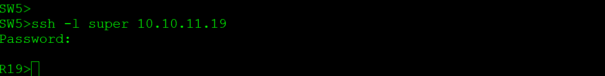

# **Основные протоколы сети интернет**
________________________________________________________
1. Настроите NAT(PAT) на R14 и R15. Трансляция должна осуществляться в адрес автономной системы AS1001.
2. Настроите NAT(PAT) на R18. Трансляция должна осуществляться в пул из 5 адресов автономной системы AS2042.
3. Настроите статический NAT для R20.
4. Настроите NAT так, чтобы R19 был доступен с любого узла для удаленного управления.

    5 *.  Настроите статический NAT(PAT) для офиса Чокурдах.
5. Настроите для IPv4 DHCP сервер в офисе Москва на маршрутизаторах R12 и R13. VPC1 и VPC7 должны получать сетевые настройки по DHCP.
6. Настроите NTP сервер на R12 и R13. Все устройства в офисе Москва должны синхронизировать время с R12 и R13.
7. Все офисы в лабораторной работе должны иметь IP связность.
8. План работы и изменения зафиксированы в документации.

1.
За границу МСК выдаем публичный адрес 135.135.135.1

объявляем пул Nat
<pre><code>ip nat pool MSK с 135.135.135.1 netmask 255.255.255.252</code></pre>
создадим акцесс лист, для сетей VPC1, VPC7
<pre><code>access-list 1 permit 192.168.0.0 0.0.255.255</code></pre>
сопостовляем пул нат со списком ACL 1, overload - говорит о PAT
<pre><code>ip nat inside source list 1 pool MSK overload</code></pre>

Чтобы работала связь между офисами, обявляем сеть 135.135.135.0 в BGP
Чтобы работала связь между офисами, обявляем 
<pre><code> network 135.135.135.0 mask 255.255.255.252<code></pre>

проверяем работу нат, пингуем в сторону сети СПБ

проверяем по Wireshark

на R15
<pre><code>show nat translations<code></pre>

2. 
в пул для СПб добавляем 5 адресов с 136.136.136.1 по 136.136.136.5

<pre><code>ip nat pool SPB 136.136.136.1 136.136.136.5 netmask 255.255.255.248<code></pre>

в остальном настройки аналогичные 

<pre><code>access-list 1 permit 192.168.0.0 0.0.255.255
ip nat inside source list 1 pool SPB overload<code></pre>

анонсируем сеть 136.136.136.0 в BGP через добавление в префикс лист

<pre><code>ip prefix-list NO_TRANSIT seq 20 permit 136.136.136.0/29
ip route 136.136.136.0 255.255.255.248 Null0

router bgp 2042
neighbor 172.16.5.21 prefix-list NO_TRANSIT out
neighbor 172.16.5.25 prefix-list NO_TRANSIT out<code></pre>

3. 

Делаем настройки для R20 на граничных R15 R14, используем статический NAT IP 137.137.137.20 вместо лупбек  10.10.11.20 

<pre><code>ip nat inside source static 10.10.11.20 137.137.137.20<code></pre>

4.

Сделаем настройки на R19 для доступа через ssh

<pre><code>line vty 1 4
 privilege level 15
 login local
 transport input ssh

 username super secret super<code></pre>

Делаем настройки для R19 на граничных R15 R14, используем статический NAT IP 138.138.138.190 вместо лупбек  10.10.11.19, используем перенаправление портов

<pre><code>ip nat inside source static tcp 10.10.11.19 22 138.138.138.19 2222 extendable<code></pre>

проверяем доступность R19 из Москвы

Из сети СПБ, подключим эмулятор ПК на место VPC8 для доступа по SSH. при этом при подключении используем порт 2222

доступ получен

из Чокурдах аналогично

