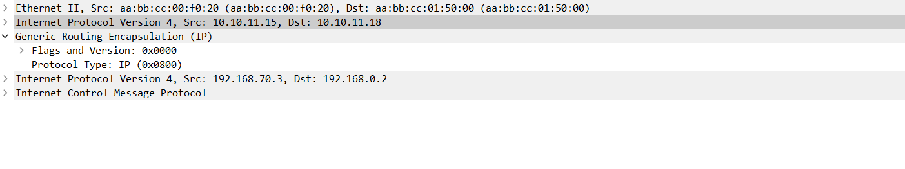

# **VPN. GRE. DmVPN**
1. Настроите GRE между офисами Москва и С.-Петербург.
2. Настроите DMVMN между Москва и Чокурдах, Лабытнанги.
3. Все узлы в офисах в лабораторной работе должны иметь IP связность.
4. План работы и изменения зафиксированы в документации.
________________________________________________________


1. 
Настроим GRE между граничными марщрутизаторами МСК и СПБ.

 R15.

```
interface Tunnel0
description TO_SPB
```
- задаем  тип туннеля

```tunnel mode gre ip```

- Задаем ip адрес тунеля

 ```ip address 192.168.170.1 255.255.255.0```

- Указываем адрес отправителя- лупбек R15

 ```tunnel source 10.10.11.15```


- Указываем адрес удаленной стороны - лупбек R15

 ```tunnel destination 10.10.11.18```

 - Поскольку туннель виртуальный, нужно отслеживать активность соседнего маршрутизатора и автоматически отключать туннель, если связь теряется. Это помогает поддерживать работоспособность сети, автоматически отключая туннель, если соседний маршрутизатор перестает отвечать.

 
 ```keepalive 10```


- Поскольку GRE является протоколом инкапсуляции, мы устанавливаем максимальную единицу передачи (MTU - Maximum Transfer Unit) до 1400 байт, а максимальный размер сегмента (MSS - Maximum Segment Size) - до 1360 байт. Поскольку большинство транспортных MTU имеют размер 1500 байт и у нас есть дополнительные издержки из-за GRE, мы должны уменьшить MTU для учета дополнительных служебных данных. Установка 1400 является обычной практикой и гарантирует, что ненужная фрагментация пакетов будет сведена к минимуму.

 ```ip mtu 1400```

 ```ip tcp adjust-mss 1360```

Добавляем статический маршрут, где указываем, что сеть к VPC8 будет доступна чере  ip удаленного конца Tunnel 0
```ip route 192.168.80.0 255.255.255.0 192.168.170.2```

Такой же маршрут к VPC

```ip route 192.168.0.0 255.255.255.0 192.168.170.2```


на R14 пропишем аналогичный туннель и статику
R14:
<details>
<summary>настройки R14</summary>

```
interface Tunnel1
 description TO_SPB_R18
 ip address 192.168.180.1 255.255.255.0
 ip mtu 1400
 ip tcp adjust-mss 1360
 keepalive 10 5
 tunnel source 10.10.11.14
 tunnel destination 10.10.11.18

ip route 192.168.0.0 255.255.255.0 192.168.180.2
ip route 192.168.80.0 255.255.255.0 192.168.180.2
```

</details> 


с противоположной стороны R18 проводим аналогичные настройки


```
interface Tunnel0
tunnel mode gre ip
 description TO_MSK_R15
 ip address 192.168.170.2 255.255.255.0
 ip mtu 1400
 ip tcp adjust-mss 1360
 keepalive 10 5
 tunnel source 10.10.11.18
 tunnel destination 10.10.11.15
!
interface Tunnel1
tunnel mode gre ip
 description TO_MSK_R14
 ip address 192.168.180.2 255.255.255.0
 ip mtu 1400
 ip tcp adjust-mss 1360
 keepalive 10 5
 tunnel source 10.10.11.18
 tunnel destination 10.10.11.14

ip route 192.168.10.0 255.255.255.0 192.168.170.1
ip route 192.168.10.0 255.255.255.0 192.168.180.1 100
ip route 192.168.70.0 255.255.255.0 192.168.170.1
ip route 192.168.70.0 255.255.255.0 192.168.180.1 100

```
</details>

проверяем работу туннелей, пингуя с VPC7


Через Wireshark видим что появляется два ip заголовка туннеля и внутренний с изначальными ip, а также появляется GRE заголовок




2.


[конфигурация узлов](conf/)