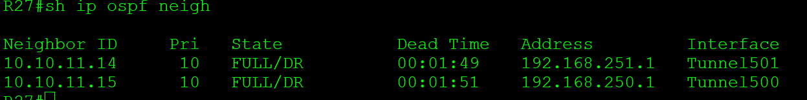

# **VPN. GRE. DmVPN**
1. Настроите GRE между офисами Москва и С.-Петербург.
2. Настроите DMVMN между Москва и Чокурдах, Лабытнанги.
3. Все узлы в офисах в лабораторной работе должны иметь IP связность.
4. План работы и изменения зафиксированы в документации.
________________________________________________________


1. 
Настроим GRE между граничными марщрутизаторами МСК и СПБ.

 R15.

```
interface Tunnel0
description TO_SPB
```
- задаем  тип туннеля

```tunnel mode gre ip```

- Задаем ip адрес тунеля

 ```ip address 192.168.170.1 255.255.255.0```

- Указываем адрес отправителя- лупбек R15

 ```tunnel source 10.10.11.15```


- Указываем адрес удаленной стороны - лупбек R18

 ```tunnel destination 10.10.11.18```

 - Поскольку туннель виртуальный, нужно отслеживать активность соседнего маршрутизатора и автоматически отключать туннель, если связь теряется. Это помогает поддерживать работоспособность сети, автоматически отключая туннель, если соседний маршрутизатор перестает отвечать.

 
 ```keepalive 10```


- Поскольку GRE является протоколом инкапсуляции, мы устанавливаем максимальную единицу передачи (MTU - Maximum Transfer Unit) до 1400 байт, а максимальный размер сегмента (MSS - Maximum Segment Size) - до 1360 байт. Поскольку большинство транспортных MTU имеют размер 1500 байт и у нас есть дополнительные издержки из-за GRE, мы должны уменьшить MTU для учета дополнительных служебных данных. Установка 1400 является обычной практикой и гарантирует, что ненужная фрагментация пакетов будет сведена к минимуму.

 ```ip mtu 1400```

 ```ip tcp adjust-mss 1360```

Добавляем статический маршрут, где указываем, что сеть к VPC8 будет доступна чере  ip удаленного конца Tunnel 0

```ip route 192.168.80.0 255.255.255.0 192.168.170.2```

Такой же маршрут к VPC

```ip route 192.168.0.0 255.255.255.0 192.168.170.2```


на R14 пропишем аналогичный туннель и статику


<details>
<summary>настройки R14</summary>

```
interface Tunnel1
 description TO_SPB_R18
 ip address 192.168.180.1 255.255.255.0
 ip mtu 1400
 ip tcp adjust-mss 1360
 keepalive 10 5
 tunnel source 10.10.11.14
 tunnel destination 10.10.11.18

ip route 192.168.0.0 255.255.255.0 192.168.180.2
ip route 192.168.80.0 255.255.255.0 192.168.180.2
```

</details> 


с противоположной стороны R18 проводим аналогичные настройки

<details>
<summary>настройки R18</summary>

```
interface Tunnel0
tunnel mode gre ip
 description TO_MSK_R15
 ip address 192.168.170.2 255.255.255.0
 ip mtu 1400
 ip tcp adjust-mss 1360
 keepalive 10 5
 tunnel source 10.10.11.18
 tunnel destination 10.10.11.15
!
interface Tunnel1
tunnel mode gre ip
 description TO_MSK_R14
 ip address 192.168.180.2 255.255.255.0
 ip mtu 1400
 ip tcp adjust-mss 1360
 keepalive 10 5
 tunnel source 10.10.11.18
 tunnel destination 10.10.11.14

ip route 192.168.10.0 255.255.255.0 192.168.170.1
ip route 192.168.10.0 255.255.255.0 192.168.180.1 100
ip route 192.168.70.0 255.255.255.0 192.168.170.1
ip route 192.168.70.0 255.255.255.0 192.168.180.1 100

```
</details>

проверяем работу туннелей, пингуя с VPC7


Через Wireshark видим что появляется два ip заголовка туннеля и внутренний с изначальными ip, а также появляется GRE заголовок


2.
+ обеспечим связанность между внешними интефейсами  МСК и и Чокурдах, Лабытнанги, для этого проанонсируем соответствующие сети в BGP на пограничных узлах R25, R26, R21, R22, R24, R23

проверяем связность из R27, пропингуем внешние интерфейсы к R14 R15


Также добились связности со стороны R28


- схема в части Dmvpn


для помехоустойчивости настраиваем два облака DMVPN с хабами R14 R15

Начинаем с хаба R14

Настраиваем GRE туннели
```
interface Tunnel501
ip address 192.168.251.1 255.255.255.0
ip mtu 1400
 keepalive 10 5
```
В качестве адреса отправителя в пакете выходящем из mGRE-интерфейса будет использоваться IP-адрес физического интерфейса, а адрес получателя будет выучен динамически с помощью протокола NHRP.

Настройка соответствия между туннельным интерфейсом и физическим:

```tunnel source 172.16.5.1```

Включение mGRE-туннеля:

 ```tunnel mode gre multipoint```

Задание ключа, который идентифицирует туннель:


```tunnel key 501```

аналогично настраиваем GRE часть на Spoke - R27 и R28
<details>
<summary> R27</summary>

```interface Tunnel501
 ip address 192.168.251.3 255.255.255.0
 ip mtu 1400
 keepalive 10 5
 tunnel source 172.16.5.38
 tunnel mode gre multipoint
 tunnel key 501 
  ```
</details>

<details>
<summary> R28</summary>

```
interface Tunnel501
 ip address 192.168.251.2 255.255.255.0
 ip mtu 1400
 keepalive 10 5
 tunnel source 172.16.5.30
 tunnel mode gre multipoint
 tunnel key 501
 ```

</details>


<details>
<summary>Next Hop Resolution Protocol (NHRP)</summary>
Next Hop Resolution Protocol (NHRP) — клиент-серверный протокол преобразования адресов, позволяющий всем хостам, которые находятся в NBMA(Non Broadcast Multiple Access)-сети, динамически выучить NBMA-адреса (физические адреса) друг друга обращаясь к next-hop-серверу (NHS). После этого хосты могут обмениваться информацией друг с другом напрямую.

В сети DMVPN:

Hub-маршрутизатор будет работать как NHS, а spoke-маршрутизаторы будут клиентами.
Hub-маршрутизатор хранит и обслуживает базу данных NHRP, в которой хранятся соответствия между физическими адресами и адресами mGRE-туннелей spoke-маршрутизаторов.
На каждом spoke-маршрутизаторе hub-маршрутизатор статически указан как NHS и задано соответствие между физическим адресом и адресом mGRE-туннеля hub-маршрутизатора.
При включении каждый spoke-маршрутизатор регистрируется на NHS и, при необходимости, запрашивает у сервера информацию об адресах других spoke-маршрутизаторов для построения spoke-to-spoke туннелей.
Network ID - характеристика локальная для каждого маршрутизатора (аналогия - OSPF process ID). Разные интерфейсы могут участвовать в разных NHRP сессиях; это просто разграничитель того, что сессия NHRP на одном интерфейсе не та что на другом. Соответственно, совершенно не обязательно, чтобы Network ID совпадали на разных маршрутизаторах.

</details>

+ Настройка NHRP на R14 Hub


Включение NHRP на интерфейсе:
```
interface Tunnel501
ip nhrp network-id 501
```
Hub-маршрутизатор будет автоматически добавлять соответствия между адресами spoke-маршрутизаторов:

 ```ip nhrp map multicast dynamic```


+ Настройка NHRP на spoke-маршрутизаторах.

Включение NHRP на интерфейсе:
R27
```
interface Tunnel501
ip nhrp network-id 501
```
Адрес туннельного интерфейса hub-маршрутизатора указывается как next-hop-сервер:

 ```ip nhrp nhs 192.168.251.1```

Статическое соответствие между адресом mGRE-туннеля и физическим адресом hub-маршрутизатора (первый адрес — адрес туннельного интерфейса, второй — адрес внешнего физического интерфейса):

 ``` ip nhrp map 192.168.251.1 172.16.5.1 ```

 Адрес внешнего физического интерфейса hub-маршрутизатора указывается как получатель multicast-пакетов от локального маршрутизатора:

 ```ip nhrp map multicast 172.16.5.1```
 
Настройка флага неуникальности ip-адреса туннеля в базе nhrp на hub-маршрутизаторе:
 ```ip nhrp registration no-unique```


+ Проверка работы GRE тунеллей


c R27 пингуется туннельные интерфесы R14 и R28


проверка на Хабе - R14( туннель 200- на лупбеках)

подробная информация  


Суммарная информация и информация по пакетам


Получатели multicast-трафика:


+ Настройка маршрутизации(OSPF)

все туннельные интерфесы помещаем в stub-area 11

 R14
```
router ospf 1
area 11 stub

interface Tunnel501
 ip ospf 1 area 11
```


R28


```

router ospf 1
 network 10.10.11.28 0.0.0.0 area 11
 network 192.168.250.0 0.0.0.255 area 11
```

На hub-маршрутизаторе и spoke-маршрутизаторах отличаются настройки приоритетов, остальные настройки совпадают.

Приоритет интерфейса влияет на то, какой маршрутизатор будет выбран выделенным маршрутизатором (DR) для сети. В топологии "звезда" роль DR должен взять на себя центральный маршрутизатор.

На hub-маршрутизаторе приоритет устанавливается 10:

```ip ospf priority 10```

На spoke-маршрутизаторах R27 R28 приоритет устанавливается 0 для того чтобы маршрутизаторы не могли участвовать в выборах DR:
```
interface Tunnel501
ip ospf priority 0
```
Указание типа сети OSPF на mGRE-интерфейсе:

```ip ospf network broadcast```

Изменение интервала между отправкой hello-пакетов:
 
 ```ip ospf hello-interval 30```

Итого настройк DMVPN 
<details>
<summary> R28</summary>

```
interface Tunnel501
 ip address 192.168.251.2 255.255.255.0
 no ip redirects
 ip mtu 1400
 ip nhrp map 192.168.251.1 172.16.5.1
 ip nhrp map multicast 172.16.5.1
 ip nhrp network-id 501
 ip nhrp nhs 192.168.251.1
 ip nhrp registration no-unique
 ip ospf network broadcast
 ip ospf hello-interval 30
 ip ospf priority 0
 keepalive 10 5
 tunnel source 172.16.5.30
 tunnel mode gre multipoint
 tunnel key 501

router ospf 1
 network 10.10.11.28 0.0.0.0 area 11
 network 192.168.250.0 0.0.0.255 area 11

 ```

</details>

<details>
<summary> R27</summary>

```
interface Tunnel501
 ip address 192.168.251.3 255.255.255.0
 no ip redirects
 ip mtu 1400
 ip nhrp map 192.168.251.1 172.16.5.1
 ip nhrp map multicast 172.16.5.1
 ip nhrp network-id 501
 ip nhrp nhs 192.168.251.1
 ip nhrp registration no-unique
 ip ospf network broadcast
 ip ospf hello-interval 30
 ip ospf priority 0
 keepalive 10 5
 tunnel source 172.16.5.38
 tunnel mode gre multipoint
 tunnel key 501
 router ospf 1

 area 11 stub
 network 10.10.11.27 0.0.0.0 area 11
 network 192.168.251.0 0.0.0.255 area 11

 ```

</details>
<details>
<summary> R14</summary>

```
interface Tunnel501
 ip address 192.168.251.1 255.255.255.0
 no ip redirects
 ip mtu 1400
 ip nhrp map multicast dynamic
 ip nhrp network-id 501
 ip ospf network broadcast
 ip ospf hello-interval 30
 ip ospf priority 10
 ip ospf 1 area 11
 keepalive 10 5
 tunnel source 172.16.5.1
 tunnel mode gre multipoint
 tunnel key 501
router ospf 1
 area 11 stub

 ```


</details>


аналогично настраиваем туннель 500 между R15 и R27 R28

проверяем работу OSPF

R27



R14


После включения всех маршрутизаторов в Москве проверяем таблицу маршрутизации и связность между офисами

<details>
<summary> R28</summary>

```
R28#show ip route
Codes: L - local, C - connected, S - static, R - RIP, M - mobile, B - BGP
       D - EIGRP, EX - EIGRP external, O - OSPF, IA - OSPF inter area
       N1 - OSPF NSSA external type 1, N2 - OSPF NSSA external type 2
       E1 - OSPF external type 1, E2 - OSPF external type 2
       i - IS-IS, su - IS-IS summary, L1 - IS-IS level-1, L2 - IS-IS level-2
       ia - IS-IS inter area, * - candidate default, U - per-user static route
       o - ODR, P - periodic downloaded static route, H - NHRP, l - LISP
       a - application route
       + - replicated route, % - next hop override

Gateway of last resort is 172.16.5.33 to network 0.0.0.0

S*    0.0.0.0/0 [1/0] via 172.16.5.33
                [1/0] via 172.16.5.29
      10.0.0.0/8 is variably subnetted, 28 subnets, 2 masks
O IA     10.10.11.2/32 [110/1031] via 192.168.251.1, 00:01:09, Tunnel501
                       [110/1031] via 192.168.250.1, 00:01:09, Tunnel500
O IA     10.10.11.3/32 [110/1031] via 192.168.251.1, 00:01:09, Tunnel501
                       [110/1031] via 192.168.250.1, 00:01:09, Tunnel500
O IA     10.10.11.4/32 [110/1021] via 192.168.251.1, 00:01:19, Tunnel501
                       [110/1021] via 192.168.250.1, 00:01:19, Tunnel500
O IA     10.10.11.5/32 [110/1021] via 192.168.251.1, 00:01:19, Tunnel501
                       [110/1021] via 192.168.250.1, 00:01:19, Tunnel500
O IA     10.10.11.12/32 [110/1011] via 192.168.251.1, 00:01:59, Tunnel501
                        [110/1011] via 192.168.250.1, 00:02:01, Tunnel500
O IA     10.10.11.13/32 [110/1011] via 192.168.251.1, 00:02:09, Tunnel501
                        [110/1011] via 192.168.250.1, 00:02:11, Tunnel500
O IA     10.10.11.14/32 [110/1001] via 192.168.251.1, 00:51:17, Tunnel501
O IA     10.10.11.15/32 [110/1001] via 192.168.250.1, 00:51:17, Tunnel500
O IA     10.10.11.19/32 [110/1011] via 192.168.251.1, 00:01:59, Tunnel501
O IA     10.10.11.20/32 [110/1011] via 192.168.250.1, 00:01:51, Tunnel500
O        10.10.11.27/32 [110/1001] via 192.168.251.3, 00:51:17, Tunnel501
                        [110/1001] via 192.168.250.3, 00:51:17, Tunnel500
C        10.10.11.28/32 is directly connected, Loopback0
O IA     10.220.32.0/30 [110/1010] via 192.168.251.1, 00:51:17, Tunnel501
O IA     10.220.32.4/30 [110/1010] via 192.168.251.1, 00:51:17, Tunnel501
O IA     10.220.32.8/30 [110/1010] via 192.168.251.1, 00:51:17, Tunnel501
O IA     10.220.32.12/30 [110/1010] via 192.168.250.1, 00:51:17, Tunnel500
O IA     10.220.32.16/30 [110/1010] via 192.168.250.1, 00:51:17, Tunnel500
O IA     10.220.32.20/30 [110/1010] via 192.168.250.1, 00:51:17, Tunnel500
O IA     10.220.32.24/30 [110/1030] via 192.168.251.1, 00:01:19, Tunnel501
                         [110/1030] via 192.168.250.1, 00:01:19, Tunnel500
O IA     10.220.32.28/30 [110/1030] via 192.168.251.1, 00:01:19, Tunnel501
                         [110/1030] via 192.168.250.1, 00:01:19, Tunnel500
O IA     10.220.32.32/30 [110/1030] via 192.168.251.1, 00:01:19, Tunnel501
                         [110/1030] via 192.168.250.1, 00:01:19, Tunnel500
O IA     10.220.32.36/30 [110/1030] via 192.168.251.1, 00:01:19, Tunnel501
                         [110/1030] via 192.168.250.1, 00:01:19, Tunnel500
O IA     10.220.32.40/30 [110/1030] via 192.168.251.1, 00:01:19, Tunnel501
                         [110/1030] via 192.168.250.1, 00:01:19, Tunnel500
O IA     10.220.32.44/30 [110/1020] via 192.168.251.1, 00:01:59, Tunnel501
                         [110/1020] via 192.168.250.1, 00:02:01, Tunnel500
O IA     10.220.32.48/30 [110/1020] via 192.168.251.1, 00:02:09, Tunnel501
                         [110/1020] via 192.168.250.1, 00:02:11, Tunnel500
O IA     10.220.32.52/30 [110/1020] via 192.168.251.1, 00:02:09, Tunnel501
                         [110/1020] via 192.168.250.1, 00:02:11, Tunnel500
O IA     10.220.32.56/30 [110/1020] via 192.168.251.1, 00:01:59, Tunnel501
                         [110/1020] via 192.168.250.1, 00:02:01, Tunnel500
O IA     10.220.32.60/30 [110/1010] via 192.168.251.1, 00:51:17, Tunnel501
                         [110/1010] via 192.168.250.1, 00:51:17, Tunnel500
      172.16.0.0/16 is variably subnetted, 4 subnets, 2 masks
C        172.16.5.28/30 is directly connected, Ethernet0/0
L        172.16.5.30/32 is directly connected, Ethernet0/0
C        172.16.5.32/30 is directly connected, Ethernet0/1
L        172.16.5.34/32 is directly connected, Ethernet0/1
O IA  192.168.10.0/24 [110/1040] via 192.168.251.1, 00:01:09, Tunnel501
                      [110/1040] via 192.168.250.1, 00:01:09, Tunnel500
      192.168.30.0/24 is variably subnetted, 2 subnets, 2 masks
C        192.168.30.0/24 is directly connected, Ethernet0/2.30
L        192.168.30.1/32 is directly connected, Ethernet0/2.30
      192.168.31.0/24 is variably subnetted, 2 subnets, 2 masks
C        192.168.31.0/24 is directly connected, Ethernet0/2.31
L        192.168.31.1/32 is directly connected, Ethernet0/2.31
O IA  192.168.70.0/24 [110/1040] via 192.168.251.1, 00:01:09, Tunnel501
                      [110/1040] via 192.168.250.1, 00:01:09, Tunnel500
      192.168.150.0/24 is variably subnetted, 2 subnets, 2 masks
C        192.168.150.0/24 is directly connected, Tunnel200
L        192.168.150.2/32 is directly connected, Tunnel200
      192.168.200.0/24 is variably subnetted, 2 subnets, 2 masks
C        192.168.200.0/24 is directly connected, Tunnel100
L        192.168.200.2/32 is directly connected, Tunnel100
      192.168.250.0/24 is variably subnetted, 2 subnets, 2 masks
C        192.168.250.0/24 is directly connected, Tunnel500
L        192.168.250.2/32 is directly connected, Tunnel500
      192.168.251.0/24 is variably subnetted, 2 subnets, 2 masks
C        192.168.251.0/24 is directly connected, Tunnel501
L        192.168.251.2/32 is directly connected, Tunnel501


 ```


</details>


[конфигурация узлов](conf/)

[1](1/)