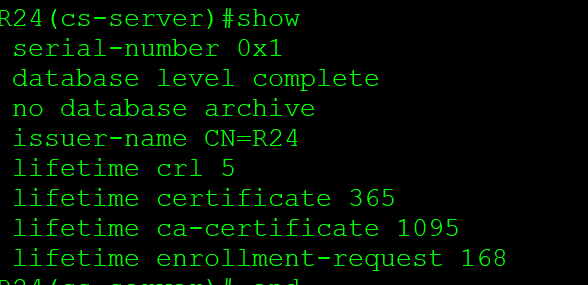
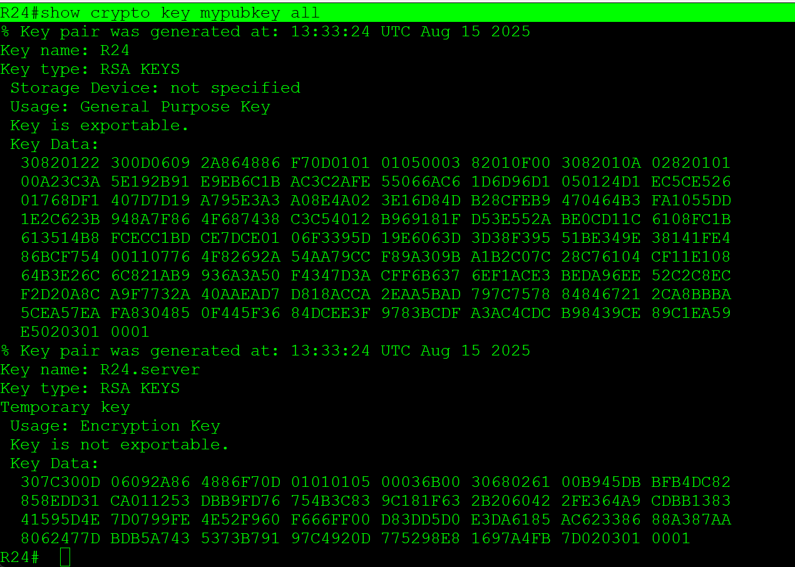
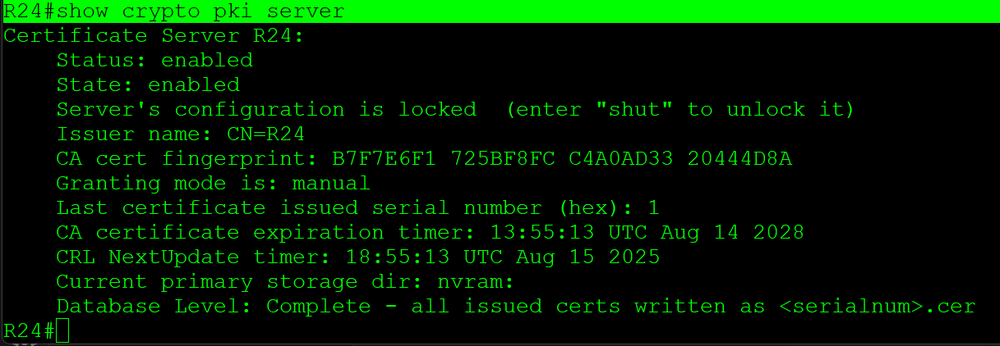
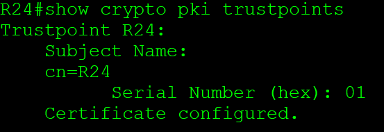
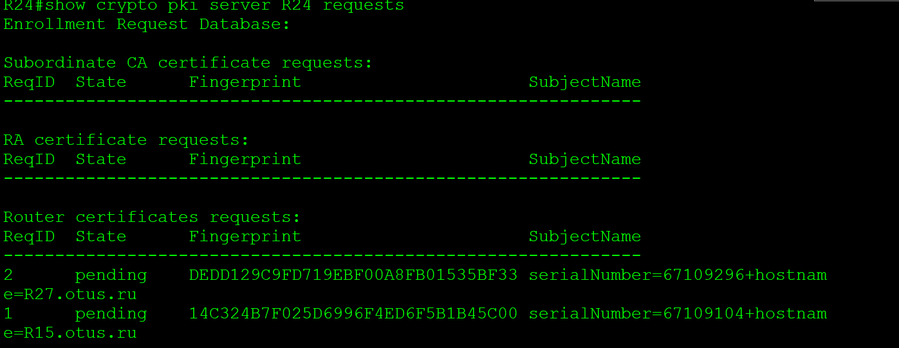
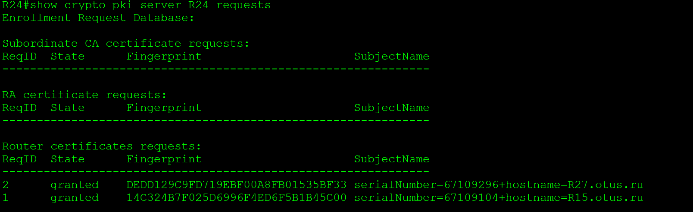
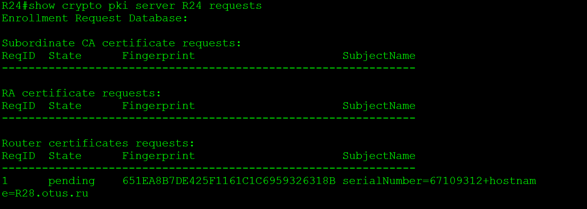
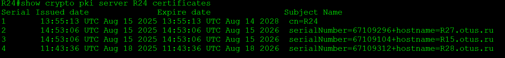
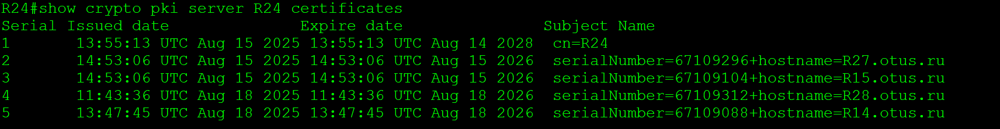

# **IPSec over DmVPN**

Цель:
Настроить GRE поверх IPSec между офисами Москва и С.-Петербург
Настроить DMVPN поверх IPSec между офисами Москва и Чокурдах, Лабытнанги

+ Настроите GRE поверх IPSec между офисами Москва и С.-Петербург.
* Настроите DMVPN поверх IPSec между Москва и Чокурдах, Лабытнанги.

________________________________________________________

1.


 ```
crypto isakmp policy 10
 encr 3des
 hash sha256
 authentication pre-share
 group 2
crypto isakmp key BUBLIL address 172.16.5.22
!
!
crypto ipsec transform-set TO_R18 esp-3des esp-sha256-hmac
 mode transport
!
crypto ipsec profile PROFILE
 set transform-set TO_R18

interface Tunnel0
 ip address 192.168.170.1 255.255.255.0
 ip mtu 1400
 ip tcp adjust-mss 1360
 keepalive 10 5
 tunnel source 172.16.5.5
 tunnel mode ipsec ipv4
 tunnel destination 172.16.5.22
 tunnel protection ipsec profile PROFILE
 ```

 ``` 
crypto ikev2 proposal PHASE1
 encryption aes-cbc-128
 integrity sha256
 group 2
!
crypto ikev2 policy 10
 proposal PHASE1
!
!
crypto ikev2 profile PROFILE1
 match identity remote address 172.16.5.22 255.255.255.252
 authentication remote pre-share key PASSWORD
 authentication local pre-share key PASSWORD
!
!
!
crypto ipsec transform-set IPSEC_TS esp-aes esp-md5-hmac
 mode tunnel
!
crypto ipsec profile TO_R18
 set transform-set IPSEC_TS
 set ikev2-profile PROFILE1
 ```


2.

Настройка сервера 
 ```
ip domain name otus.ru

ip http server
 
crypto key generate rsa general-keys label R24 modulus 2048 ex
 ```


 ```
R24(config)#crypto pki server R24
R24(cs-server)#database level complete
R24(cs-server)#lifetime crl 5
R24(cs-server)#no shutdown
 ```














- Настройка клиентов


 ```

 Клиент:
ip domain name otus.ru
ip host R24 10.10.11.24
crypto key generate rsa
 ```

crypto pki trustpoint R24
 enrollment url http://R24:80

Получение клиентом сертификата сервера:
Клиент:
crypto pki authenticate R24

Получение клиентом сертификата для себя:
Клиент:
crypto pki enroll R24


После этого идем на сервер 
проверяем запросы на сертификат

 ```R24#show crypto pki server R24 requests ```




Cервер (из привелегированного режима!): подтверждаем запрос на сертификат.


 ```crypto pki server R24 grant all ```

после этого проверяем выданные сетификаты

```R24#show crypto pki server R24 certificates```



проверяем от клиента

```show crypto pki certificates```




[конфигурация узлов](conf/)

[1](1/)