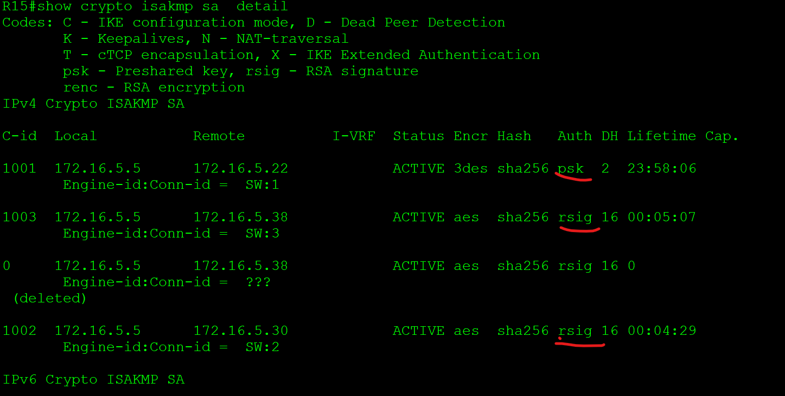

# **IPSec over DmVPN**

Цель:
Настроить GRE поверх IPSec между офисами Москва и С.-Петербург
Настроить DMVPN поверх IPSec между офисами Москва и Чокурдах, Лабытнанги

+ Настроите GRE поверх IPSec между офисами Москва и С.-Петербург.
* Настроите DMVPN поверх IPSec между Москва и Чокурдах, Лабытнанги.

________________________________________________________

1.


 ```
crypto isakmp policy 10
 encr 3des
 hash sha256
 authentication pre-share
 group 2
crypto isakmp key BUBLIL address 172.16.5.22
!
!
crypto ipsec transform-set TO_R18 esp-3des esp-sha256-hmac
 mode transport
!
crypto ipsec profile PROFILE
 set transform-set TO_R18

interface Tunnel0
 ip address 192.168.170.1 255.255.255.0
 ip mtu 1400
 ip tcp adjust-mss 1360
 keepalive 10 5
 tunnel source 172.16.5.5
 tunnel mode ipsec ipv4
 tunnel destination 172.16.5.22
 tunnel protection ipsec profile PROFILE
 ```

 ``` 
crypto ikev2 proposal PHASE1
 encryption aes-cbc-128
 integrity sha256
 group 2
!
crypto ikev2 policy 10
 proposal PHASE1
!
!
crypto ikev2 profile PROFILE1
 match identity remote address 172.16.5.22 255.255.255.252
 authentication remote pre-share key PASSWORD
 authentication local pre-share key PASSWORD
!
!
!
crypto ipsec transform-set IPSEC_TS esp-aes esp-md5-hmac
 mode tunnel
!
crypto ipsec profile TO_R18
 set transform-set IPSEC_TS
 set ikev2-profile PROFILE1
 ```


2.

Настройка сервера 
 ```
ip domain name otus.ru

ip http server
 
crypto key generate rsa general-keys label R24 modulus 2048 ex
 ```


 ```
R24(config)#crypto pki server R24
R24(cs-server)#database level complete
R24(cs-server)#lifetime crl 5
R24(cs-server)#no shutdown
 ```


- Настройка клиентов


 ```

 Клиент:
ip domain name otus.ru
ip host R24 10.10.11.24
crypto key generate rsa
 ```

crypto pki trustpoint R24
 enrollment url http://R24:80

Получение клиентом сертификата сервера:
Клиент:
crypto pki authenticate R24

Получение клиентом сертификата для себя:
Клиент:
crypto pki enroll R24


После этого идем на сервер 
проверяем запросы на сертификат

 ```R24#show crypto pki server R24 requests ```


Cервер (из привелегированного режима!): подтверждаем запрос на сертификат.


 ```crypto pki server R24 grant all ```

после этого проверяем выданные сетификаты

```R24#show crypto pki server R24 certificates```


проверяем от клиента

```show crypto pki certificates```


настраиваем DMVPN туннель 500 между R15 R28 R27

- R27

1 фаза
 ```
crypto isakmp policy 20
 encr aes
 hash sha256
 group 16
 lifetime 360
 ```

2 фаза
```
 crypto ipsec transform-set DMVPN-500 esp-des
 mode transport
!
crypto ipsec profile DMVPN
 set transform-set DMVPN-500
```

применяем на туннель
```
interface Tunnel500
tunnel protection ipsec profile DMVPN
```


аналогично на R15
```
crypto isakmp policy 20
 encr aes
 hash sha256
 group 16
 lifetime 360
!
crypto isakmp policy 30
 encr 3des
 hash sha256
 authentication pre-share
 group 2
crypto isakmp key BUBLIL address 172.16.5.22
crypto isakmp key BUBLIL address 0.0.0.0
!
!
crypto ipsec transform-set TO_R18 esp-3des esp-sha256-hmac
 mode transport
crypto ipsec transform-set DMVPN-TR esp-des
 mode transport
crypto ipsec transform-set DMVPN-500 esp-des
 mode transport
!
crypto ipsec profile DMVPN
 set transform-set DMVPN-500

interface Tunnel500
 tunnel protection ipsec profile DMVPN
```

После пинга на туннельные IP туннель поднимается


проверяем как работаем IPSEC





 ```
R15#show crypto ipsec sa

interface: Tunnel0
    Crypto map tag: Tunnel0-head-0, local addr 172.16.5.5

   protected vrf: (none)
   local  ident (addr/mask/prot/port): (0.0.0.0/0.0.0.0/0/0)
   remote ident (addr/mask/prot/port): (0.0.0.0/0.0.0.0/0/0)
   current_peer 172.16.5.22 port 500
     PERMIT, flags={origin_is_acl,}
    #pkts encaps: 0, #pkts encrypt: 0, #pkts digest: 0
    #pkts decaps: 0, #pkts decrypt: 0, #pkts verify: 0
    #pkts compressed: 0, #pkts decompressed: 0
    #pkts not compressed: 0, #pkts compr. failed: 0
    #pkts not decompressed: 0, #pkts decompress failed: 0
    #send errors 0, #recv errors 0

     local crypto endpt.: 172.16.5.5, remote crypto endpt.: 172.16.5.22
     plaintext mtu 1446, path mtu 1500, ip mtu 1500, ip mtu idb Ethernet0/2
     current outbound spi: 0x59E5813F(1508213055)
     PFS (Y/N): N, DH group: none

     inbound esp sas:
      spi: 0x23FD4743(603801411)
        transform: esp-3des esp-sha256-hmac ,
        in use settings ={Tunnel, }
        conn id: 1, flow_id: SW:1, sibling_flags 80000040, crypto map: Tunnel0-head-0
        sa timing: remaining key lifetime (k/sec): (4608000/3235)
        IV size: 8 bytes
        replay detection support: Y
        Status: ACTIVE(ACTIVE)
      spi: 0x3B047937(990148919)
        transform: esp-3des esp-sha256-hmac ,
        in use settings ={Tunnel, }
        conn id: 3, flow_id: SW:3, sibling_flags 80000040, crypto map: Tunnel0-head-0
        sa timing: remaining key lifetime (k/sec): (4367071/3235)
        IV size: 8 bytes
        replay detection support: Y
        Status: ACTIVE(ACTIVE)

     inbound ah sas:

     inbound pcp sas:

     outbound esp sas:
      spi: 0xCE032092(3456311442)
        transform: esp-3des esp-sha256-hmac ,
        in use settings ={Tunnel, }
        conn id: 2, flow_id: SW:2, sibling_flags 80000040, crypto map: Tunnel0-head-0
        sa timing: remaining key lifetime (k/sec): (4608000/3235)
        IV size: 8 bytes
        replay detection support: Y
        Status: ACTIVE(ACTIVE)
      spi: 0x59E5813F(1508213055)
        transform: esp-3des esp-sha256-hmac ,
        in use settings ={Tunnel, }
        conn id: 4, flow_id: SW:4, sibling_flags 80000040, crypto map: Tunnel0-head-0
        sa timing: remaining key lifetime (k/sec): (4367071/3235)
        IV size: 8 bytes
        replay detection support: Y
        Status: ACTIVE(ACTIVE)

     outbound ah sas:

     outbound pcp sas:

interface: Tunnel500
    Crypto map tag: Tunnel500-head-0, local addr 172.16.5.5

   protected vrf: (none)
   local  ident (addr/mask/prot/port): (172.16.5.5/255.255.255.255/47/0)
   remote ident (addr/mask/prot/port): (172.16.5.38/255.255.255.255/47/0)
   current_peer 172.16.5.38 port 500
     PERMIT, flags={origin_is_acl,}
    #pkts encaps: 32, #pkts encrypt: 32, #pkts digest: 32
    #pkts decaps: 29, #pkts decrypt: 29, #pkts verify: 29
    #pkts compressed: 0, #pkts decompressed: 0
    #pkts not compressed: 0, #pkts compr. failed: 0
    #pkts not decompressed: 0, #pkts decompress failed: 0
    #send errors 0, #recv errors 0

     local crypto endpt.: 172.16.5.5, remote crypto endpt.: 172.16.5.38
     plaintext mtu 1482, path mtu 1500, ip mtu 1500, ip mtu idb (none)
     current outbound spi: 0x5404C316(1409598230)
     PFS (Y/N): N, DH group: none

     inbound esp sas:
      spi: 0xAC5208E3(2891057379)
        transform: esp-des ,
        in use settings ={Transport, }
        conn id: 7, flow_id: SW:7, sibling_flags 80000000, crypto map: Tunnel500-head-0
        sa timing: remaining key lifetime (k/sec): (4303202/3266)
        IV size: 8 bytes
        replay detection support: N
        Status: ACTIVE(ACTIVE)

     inbound ah sas:

     inbound pcp sas:

     outbound esp sas:
      spi: 0x5404C316(1409598230)
        transform: esp-des ,
        in use settings ={Transport, }
        conn id: 8, flow_id: SW:8, sibling_flags 80000000, crypto map: Tunnel500-head-0
        sa timing: remaining key lifetime (k/sec): (4303201/3266)
        IV size: 8 bytes
        replay detection support: N
        Status: ACTIVE(ACTIVE)

     outbound ah sas:

     outbound pcp sas:

   protected vrf: (none)
   local  ident (addr/mask/prot/port): (172.16.5.5/255.255.255.255/47/0)
   remote ident (addr/mask/prot/port): (172.16.5.30/255.255.255.255/47/0)
   current_peer 172.16.5.30 port 500
     PERMIT, flags={origin_is_acl,}
    #pkts encaps: 33, #pkts encrypt: 33, #pkts digest: 33
    #pkts decaps: 39, #pkts decrypt: 39, #pkts verify: 39
    #pkts compressed: 0, #pkts decompressed: 0
    #pkts not compressed: 0, #pkts compr. failed: 0
    #pkts not decompressed: 0, #pkts decompress failed: 0
    #send errors 0, #recv errors 0

     local crypto endpt.: 172.16.5.5, remote crypto endpt.: 172.16.5.30
     plaintext mtu 1482, path mtu 1500, ip mtu 1500, ip mtu idb (none)
     current outbound spi: 0xBEB18ED0(3199307472)
     PFS (Y/N): N, DH group: none

     inbound esp sas:
      spi: 0x5B50C2C8(1532019400)
        transform: esp-des ,
        in use settings ={Transport, }
        conn id: 5, flow_id: SW:5, sibling_flags 80000000, crypto map: Tunnel500-head-0
        sa timing: remaining key lifetime (k/sec): (4359071/3239)
        IV size: 8 bytes
        replay detection support: N
        Status: ACTIVE(ACTIVE)

     inbound ah sas:

     inbound pcp sas:

     outbound esp sas:
      spi: 0xBEB18ED0(3199307472)
        transform: esp-des ,
        in use settings ={Transport, }
        conn id: 6, flow_id: SW:6, sibling_flags 80000000, crypto map: Tunnel500-head-0
        sa timing: remaining key lifetime (k/sec): (4359072/3239)
        IV size: 8 bytes
        replay detection support: N
        Status: ACTIVE(ACTIVE)

     outbound ah sas:

     outbound pcp sas:


 ```


 ```
R15#show dmvpn detail
Legend: Attrb --> S - Static, D - Dynamic, I - Incomplete
        N - NATed, L - Local, X - No Socket
        # Ent --> Number of NHRP entries with same NBMA peer
        NHS Status: E --> Expecting Replies, R --> Responding, W --> Waiting
        UpDn Time --> Up or Down Time for a Tunnel
==========================================================================

Interface Tunnel100 is up/up, Addr. is 192.168.200.1, VRF ""
   Tunnel Src./Dest. addr: 10.10.11.15/MGRE, Tunnel VRF ""
   Protocol/Transport: "multi-GRE/IP", Protect ""
   Interface State Control: Disabled
   nhrp event-publisher : Disabled
Type:Hub, Total NBMA Peers (v4/v6): 1

# Ent  Peer NBMA Addr Peer Tunnel Add State  UpDn Tm Attrb    Target Network
----- --------------- --------------- ----- -------- ----- -----------------
    1 10.10.11.28       192.168.200.2    UP 00:08:57    D   192.168.200.2/32

Interface Tunnel500 is up/up, Addr. is 192.168.250.1, VRF ""
   Tunnel Src./Dest. addr: 172.16.5.5/MGRE, Tunnel VRF ""
   Protocol/Transport: "multi-GRE/IP", Protect "DMVPN"
   Interface State Control: Disabled
   nhrp event-publisher : Disabled
Type:Hub, Total NBMA Peers (v4/v6): 2

# Ent  Peer NBMA Addr Peer Tunnel Add State  UpDn Tm Attrb    Target Network
----- --------------- --------------- ----- -------- ----- -----------------
    1 172.16.5.30       192.168.250.2   IKE 00:09:24    D   192.168.250.2/32
    1 172.16.5.38       192.168.250.3    UP 00:08:57    D   192.168.250.3/32


Crypto Session Details:
--------------------------------------------------------------------------------

Interface: Tunnel500
Session: [0xC21A4970]
  Crypto Session Status: UP-NO-IKE
  fvrf: (none),   IPSEC FLOW: permit 47 host 172.16.5.5 host 172.16.5.30
        Active SAs: 2, origin: crypto map
        Inbound:  #pkts dec'ed 47 drop 0 life (KB/Sec) 4359070/3035
        Outbound: #pkts enc'ed 40 drop 0 life (KB/Sec) 4359071/3035
   Outbound SPI : 0xBEB18ED0, transform : esp-des
    Socket State: Open

Interface: Tunnel500
Session: [0xC21A4878]
  Crypto Session Status: UP-NO-IKE
  fvrf: (none),   IPSEC FLOW: permit 47 host 172.16.5.5 host 172.16.5.38
        Active SAs: 2, origin: crypto map
        Inbound:  #pkts dec'ed 36 drop 0 life (KB/Sec) 4303201/3062
        Outbound: #pkts enc'ed 39 drop 0 life (KB/Sec) 4303200/3062
   Outbound SPI : 0x5404C316, transform : esp-des
    Socket State: Open

Pending DMVPN Sessions:
 ```
проверяем таблицу маршрутизации на R27, убеждаемся, туннель 500 в работе, маршруты идут через него


[конфигурация узлов](conf/)

[1](1/)