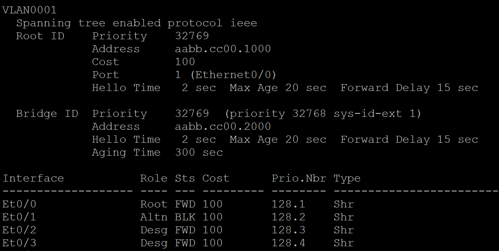

# Развертывание коммутируемой сети с резервными каналами

Цель:
Часть 1. Создание сети и настройка основных параметров устройства

Часть 2. Выбор корневого моста

Часть 3. Наблюдение за процессом выбора протоколом STP порта, исходя из стоимости портов

Часть 4. Наблюдение за процессом выбора протоколом STP порта, исходя из приоритета портов

Схема лабараторного стенда в EVE-NG

Таблица адресации.

### 1. Делаем начальные настройки

Пинг между узлами успешен
### 2. Определение корневого моста.
 Включаем порты е0/1 е0/3 на всех коммутаторах, даем команду
 Show spanning-tree
 
 
 

 Схема и роль коммутаторов моста

* Корневой коммутатор - _S2_
* Почему этот коммутатор был выбран протоколом spanning-tree в качестве корневого моста? - _при всех прочих равных - наименьший MAC адрес у S2_
* Какие порты на коммутаторе являются корневыми портами? - _S1-e0/1 для S2 - e0/1( при равной стоимости, наименьшее значение приоритета порта)_
* Какие порты на коммутаторе являются назначенными портами? _S1-нет, S2-e0/1 e0/3, S3-e0/3_
* Какой порт отображается в качестве альтернативного и в настоящее время заблокирован? _S1-e0/3_
* Почему протокол spanning-tree выбрал этот порт в качестве невыделенного (заблокированного) порта? _на линке S1(e0/3)<>S3(e0/3) в качестве назначенного(Diesignated) на основании более низкого идентификатора моста-отправителā (lowest
Bridge ID) был выбран порт S3 e0/3, поскольку порт S1 e0/1 не был выбрат корневым или назначенным, он блокируется._

### 3. Наблюдение за процессом выбора протоколом STP порта, исходя из стоимости портов.
 на коммутатору S1 меняем стоимость порта e0/1:

 S1(config)# interface e0/1

 S1(config-if)# spanning-tree cost 18

 результаты пересчета Spanning-tree

 
 
 
Почему протокол spanning-tree заменяет ранее заблокированный порт на назначенный порт и блокирует порт, который был назначенным портом на другом коммутаторе? _Изменилось значение стоимости Root ID_
### 4. Наблюдение за процессом выбора протоколом STP порта, исходя из приоритета портов.
 включаем порты e0/0 и е0/2 на всех коммутаторах, результат пересчета Spanning-tree

 
 
 