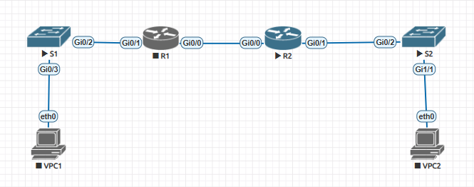
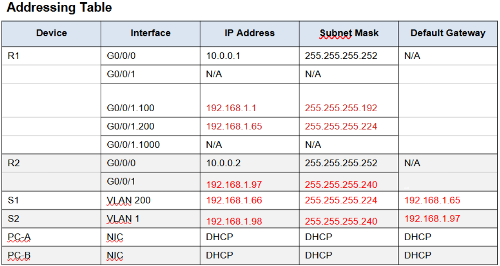
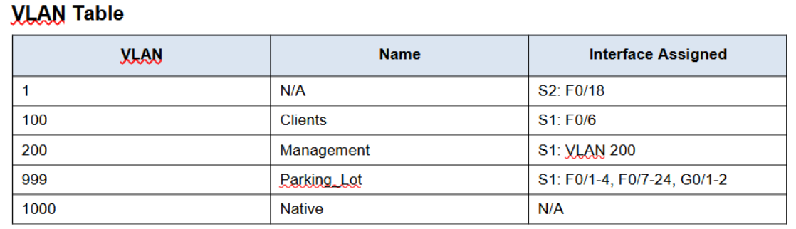

# DHCP
## DHCPv4

Схема лабараторного стенда в EVE-NG

Таблица адресации.

Таблица Vlan

Часть 1
 Разбиваем подсеть 192.168.1.0/24

 a) «Подсеть A», поддерживающая 58 хостов
 192.168.1.0/26 

записываем первый адрес в таблицу G/0/1.100 R1 

 b) «Подсеть B», поддерживающая 28 хостов 
  192.168.1.64/27 

записываем первый адрес подсети B в таблицу G/0/1.200 R1

записываем второй адрес подсети B в таблицу  VLAN 200 S1

 с) «Подсеть C», поддерживающая 12 хостов
 192.168.1.96/28

 записываем первый адрес подсети С в таблицу G/0/1 R2

- делаем стартовые настройки на всех узлах
- настраиваем сабинтерфейсы на G0/1 R1
- настраиваем G0/1 R2
- настраиваем статическую маршрутизацию между R1 и R2 через порты G0/0
- настраиваем влан на S1 
- настраивам транк порт S1

Настраиваем DHCP на R1 результат настроек
 <pre><code>R1#show running-config | section dhcp   
 ip dhcp excluded-address 192.168.1.1 192.168.1.5  
 ip dhcp excluded-address 192.168.1.97 192.168.1.101
 ip dhcp pool R1_1
  network 192.168.1.0 255.255.255.192
  domain-name ccna-lab.com
  default-router 192.168.1.1
  lease 2 12 30
 ip dhcp pool R1_2
  network 192.168.1.96 255.255.255.240
  default-router 192.168.1.97
  domain-name ccna-lab.com
  lease 2 12 30
</code></pre>

Включаем DHCP клиента на PC-A, пингуем G0/1 R1
<pre><code> 
VPCS> ip dhcp
DDORA IP 192.168.1.6/26 GW 192.168.1.1
VPCS> ping 192.168.1.1

84 bytes from 192.168.1.1 icmp_seq=1 ttl=255 time=7.275 ms
84 bytes from 192.168.1.1 icmp_seq=2 ttl=255 time=5.297 ms
84 bytes from 192.168.1.1 icmp_seq=3 ttl=255 time=5.461 ms
84 bytes from 192.168.1.1 icmp_seq=4 ttl=255 time=6.301 ms
84 bytes from 192.168.1.1 icmp_seq=5 ttl=255 time=4.949 ms
</code></pre>

Включаем ретрансляцию на R2 
<pre><code> 
R2(config)#interface gigabitEthernet 0/1
R2(config-if)#ip helper-address 10.0.0.1
R2(config-if)#end
R2#wr
</code></pre>
Включаем DHCP на PC-B, пингуем PC-A
<pre><code> 
VPCS> ip dhcp
DDORA IP 192.168.1.102/28 GW 192.168.1.97

VPCS> ping 192.168.1.6

84 bytes from 192.168.1.6 icmp_seq=1 ttl=62 time=16.474 ms
84 bytes from 192.168.1.6 icmp_seq=2 ttl=62 time=7.001 ms
84 bytes from 192.168.1.6 icmp_seq=3 ttl=62 time=8.135 ms
84 bytes from 192.168.1.6 icmp_seq=4 ttl=62 time=7.417 ms
84 bytes from 192.168.1.6 icmp_seq=5 ttl=62 time=7.841 ms
</code></pre>

Проверяем DHCP на R1
<pre><code> R1#show ip dhcp binding
Bindings from all pools not associated with VRF:
IP address          Client-ID/              Lease expiration        Type
                    Hardware address/
                    User name
192.168.1.6         0100.5079.6668.01       Mar 24 2025 11:31 PM    Automatic
192.168.1.102       0100.5079.6668.02       Mar 24 2025 11:44 PM    Automatic
R1#show ip dhcp server statistics
Memory usage         42075
Address pools        2
Database agents      0
Automatic bindings   2
Manual bindings      0
Expired bindings     0
Malformed messages   0
Secure arp entries   0
</code></pre>

[конфигурация узлов  ](conf/)