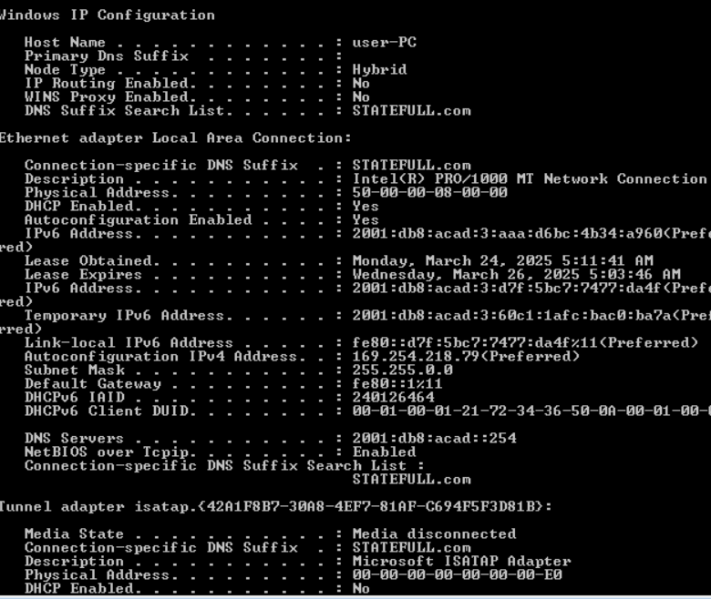

# DHCP
## DHCPv6

Схема лабараторного стенда в EVE-NG

Таблица адресации.

- делаем стартовые настройки на всех узлах
- настраиваем IPv6 на R1 и маршрут по умолчанию в сторону R2

<pre><code>
interface GigabitEthernet0/0
  ipv6 address FE80::1 link-local
  ipv6 address 2001:DB8:ACAD:2::1/64
!
interface GigabitEthernet0/1
  ipv6 address FE80::1 link-local
 ipv6 address 2001:DB8:ACAD:1::1/64
ipv6 route ::/0 2001:DB8:ACAD:2::2
</code></pre>
- аналогично настраиваем R2 и маршрут в сторону R1

### SLAAC
- Включаем на R1 и R2 присоединение ко всей группе
многоадресной рассылки IPv6 и начало отправки
сообщений RA, содержащих сведения о
конфигурации адресов, хостам с помощью SLAAC.
<pre><code>
ipv6 unicast-routing
</code></pre>

проверяем состояние IPv6 на PC Win7

Откуда взялась часть адреса с идентификатором хоста? - _В данном случае заполнилось автоматически случайным образом.
В зависимости  от конфигурации операционной системы либо хост генерирует EUI-64-адрес на основе MAC-адреса интерфейса, либо хост генерирует случайный 64-битный адрес._
 ### Настройка и проверка сервера DHCPv6 на R1

Включение протокола DHCPv6 без сохранения
состояния на интерфейсе

 - Создаём на R1 пул IPv6 DHCP с именем R1-STATELESS. Настраиваем интерфейс G0/1 на R1 так, чтобы он передавал флаг конфигурации OTHER в локальную сеть R1, и указываем только что созданный пул DHCP в качестве ресурса DHCP для этого интерфейса.
 <pre><code>
R1(config)# ipv6 dhcp pool R1-STATELESS
R1(config-dhcp)# dns-server 2001:db8:acad::254
R1(config-dhcp)# domain-name STATELESS.com
R1(config)# interface g0/0/1
R1(config-if)# ipv6 nd other-config-flag
R1(config-if)# ipv6 dhcp server R1-STATELESS
</code></pre>
проверяем на PC win7

Включение протокола DHCPv6 с поддержкой
состояния на интерфейсе
 Создайте пул DHCPv6 на R1 для сети 2001:db8:acad:3:aaaa::/80. Это позволит назначать адреса в локальной сети, подключенной к интерфейсу G0/0/1 на R2. В качестве DNS-сервера в пуле укажите 2001:db8:acad::254, а в качестве доменного имени — STATEFUL.com.
<pre><code>
R1(config)# ipv6 dhcp pool  R2_STATEFULL
R1(config-dhcp)# address prefix 2001:db8:acad:3:aaa::/80
R1(config-dhcp)# dns-server 2001:db8:acad::254
R1(config-dhcp)# domain-name STATEFULL.com
R1(config)# interface g0/0
R1(config-if)# ipv6 dhcp server R2-STATEFUL
</code></pre>
настраиваем ретрансляцию на R2
<pre><code>
interface GigabitEthernet0/1
  ipv6 address FE80::1 link-local
 ipv6 address 2001:DB8:ACAD:3::1/64
 ipv6 nd managed-config-flag
 ipv6 dhcp relay destination  2001:DB8:ACAD:2::1
 </code></pre>

проверяем состояние  DHCP на PC win8

Pезультат команды ping c win8 в сторону win7 и в сторону R1 g0/1

- [конфигурация узлов и лабараторная в EVE ](conf/)