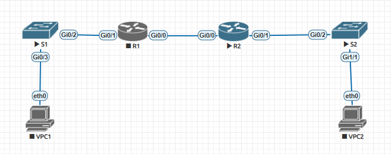

# DHCP
## DHCPv4
Схема лабараторного стенда в EVE-NG

Таблица адресации.

Таблица Vlan

Часть 1
 Разбиваем подсеть 192.168.1.0/24

 a) «Подсеть A», поддерживающая 58 хостов
 192.168.1.0/26 (.1 -.63)

записываем первый адрес в таблицу G/0/1.100 R1 

 b) «Подсеть B», поддерживающая 28 хостов 
  192.168.1.64/27 (.65-.95)

записываем первый адрес подсети B в таблицу G/0/1.200 R1

записываем второй адрес подсети B в таблицу  VLAN 200 S1

 с) «Подсеть C», поддерживающая 12 хостов
 192.168.1.96/28
 записываем первый адрес подсети С в таблицу G/0/1 R2

делаем стартовые настройки на всех узлах

настраиваем сабинтерфейсы на G0/1 R1

настраиваем G0/1 R2
 interface GigabitEthernet0/1
 description TO_S2
 ip address 192.168.1.97 255.255.255.240
