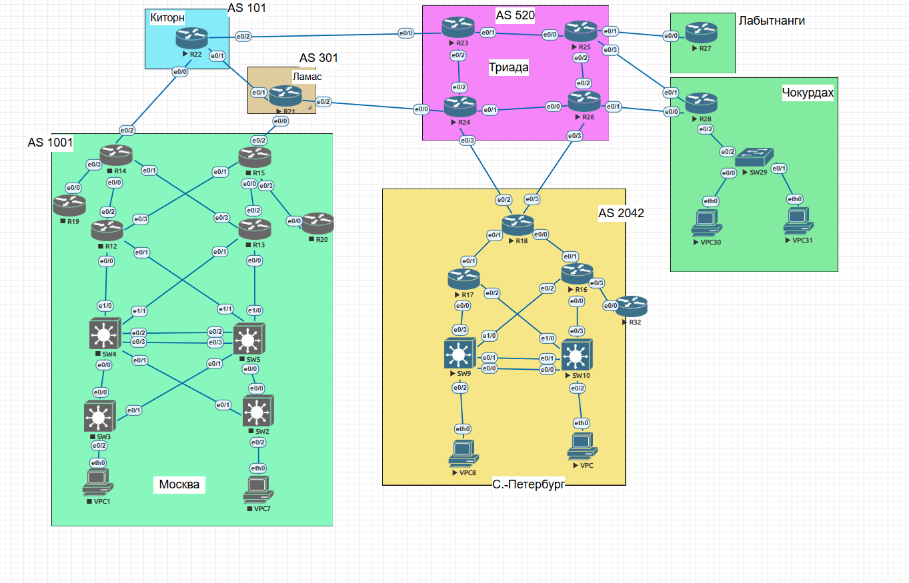
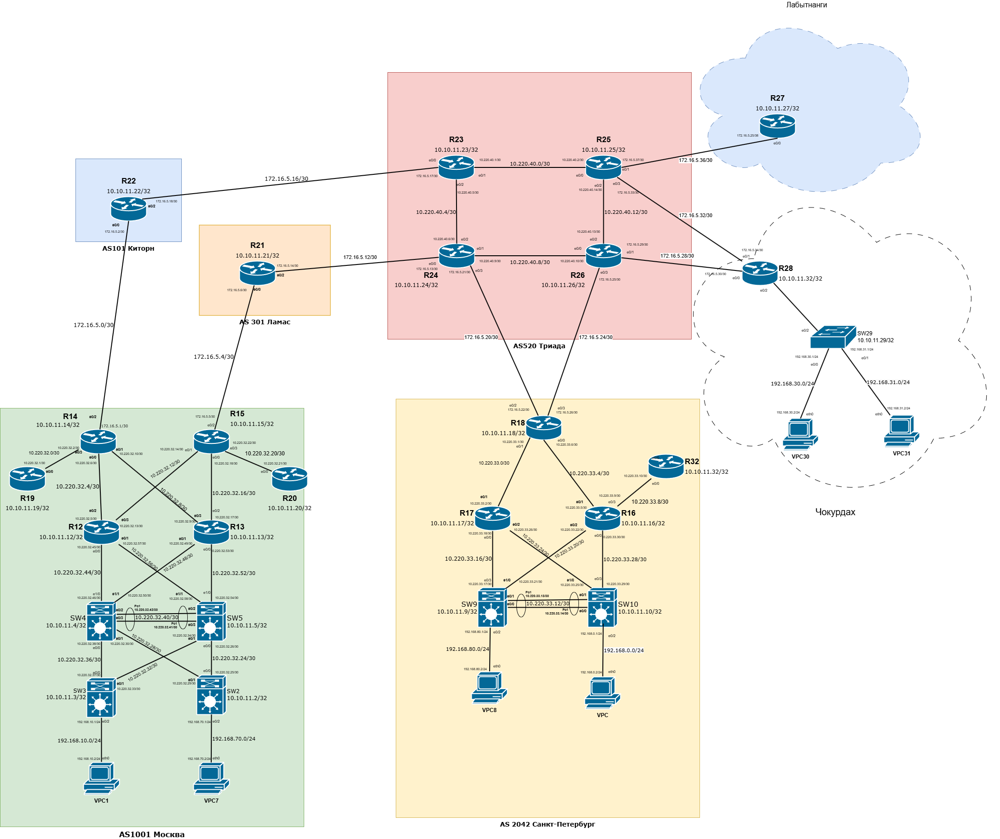
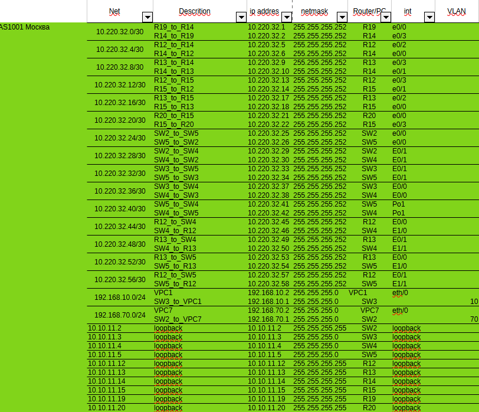
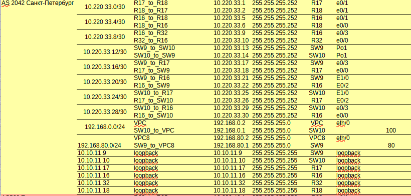

Описание/Пошаговая инструкция выполнения домашнего задания:
В этой самостоятельной работе мы ожидаем, что вы самостоятельно:

1. Разработаете и задокументируете адресное пространство для лабораторного стенда.
2. Настроите ip адреса на каждом активном порту
3. Настроите каждый VPC в каждом офисе в своем VLAN.
4. Настроите VLAN/Loopbackup interface управления для сетевых устройств
5. Настроите сети офисов так, чтобы не возникало broadcast штормов, а использование линков было максимально оптимизировано
Используете IPv4. IPv6 по желанию

Схема лабараторного стенда в EVE-NG

Схема лабараторного стенда в draw.io

Таблица адресации Москва.

Таблица адресации С-Петербург.

 
