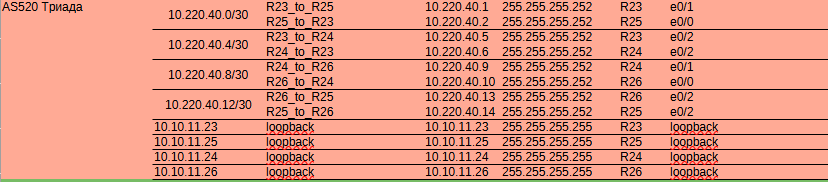
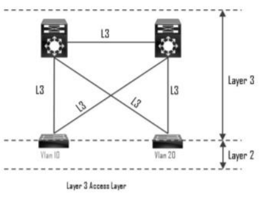

Описание/Пошаговая инструкция выполнения домашнего задания:

В этой самостоятельной работе мы ожидаем, что вы самостоятельно:

1. Разработаете и задокументируете адресное пространство для лабораторного стенда.
2. Настроите ip адреса на каждом активном порту
3. Настроите каждый VPC в каждом офисе в своем VLAN.
4. Настроите VLAN/Loopbackup interface управления для сетевых устройств
5. Настроите сети офисов так, чтобы не возникало broadcast штормов, а использование линков было максимально оптимизировано
Используете IPv4. IPv6 по желанию

Схема лабараторного стенда в EVE-NG

Схема лабараторного стенда в draw.io

Используем IP4

Таблица адресации Москва.

Таблица адресации С-Петербург.

Таблица адресации Триада.

Таблица адресации Чокурдах.

Таблица адресации между сетями.

2. Прописываем шз интерфесы на портах маршратизаторов. Пример R28,  
<pre><code>
en
conf t

interface Loopback0
 ip address 10.10.11.28 255.255.255.255
 no shut

interface Ethernet0/0
 description R28_to_R26
 ip address 172.16.5.30 255.255.255.252
 no shut

interface Ethernet0/1
 description R28_to_R25
 ip address 172.16.5.34 255.255.255.252
 no shut 

interface Ethernet0/2
 description R26_to_SW29
 no ip address
 no shut

interface Ethernet0/2.30
 encapsulation dot1Q 30
 ip address 192.168.30.2 255.255.255.0
 no shut

interface Ethernet0/2.31
 encapsulation dot1Q 31
 ip address 192.168.31.2 255.255.255.0
 no shut
end
wr
</code></pre>

Поскольку в установке используются L3 коммутатроы, то чтобы не возникало broadcast штормов, а использование линков было максимально оптимизировано будем использвать их в архитектуре Layer 3 Access Layer

Преимущества использования:
- Нет STP
- Нет протоколов FHRP – HSRP/VRRP/GLBP
- Равномерная утилизация всех линков (ECMP)
- Упрощение поиска и устранения неисправностей
-  Быстрая сходимость

между SW4 SW5 и SW9 SW10 используем агрегирование LACP
пример нстройки SW9
<pre><code>
en
conf t
interface Loopback0
 ip address 10.10.11.9 255.255.255.255
no shut
interface Port-channel1
 no switchport
 ip address 10.220.33.13 255.255.255.252
no shut
 interface Ethernet0/0
 no switchport
 no ip address
 duplex auto
 channel-group 1 mode active
interface Ethernet0/1
 no switchport
 no ip address
 duplex auto
 channel-group 1 mode active
interface Ethernet0/2
 description TO_VPC8
 switchport access vlan 80
 switchport mode access
 spanning-tree portfast
interface Ethernet0/3
 description SW9_to_R17
 no switchport
 ip address 10.220.33.17 255.255.255.252
 duplex auto
interface Ethernet1/0
 description SW9_to_R16
 no switchport
 ip address 10.220.33.21 255.255.255.252
 duplex auto

interface Vlan80
 ip address 192.168.80.1 255.255.255.0
end
wr
</code></pre>

 
