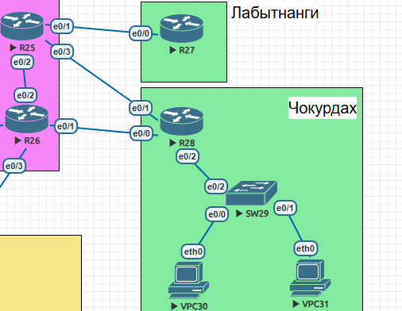
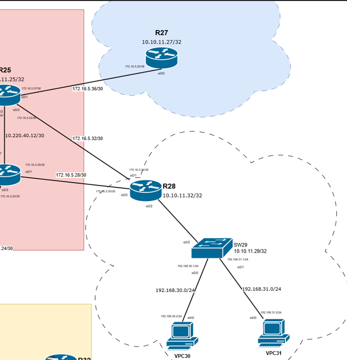
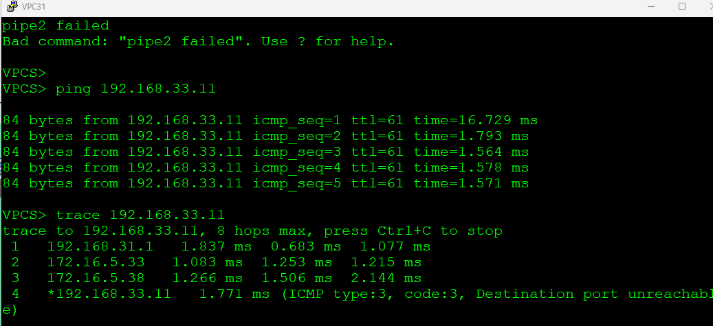
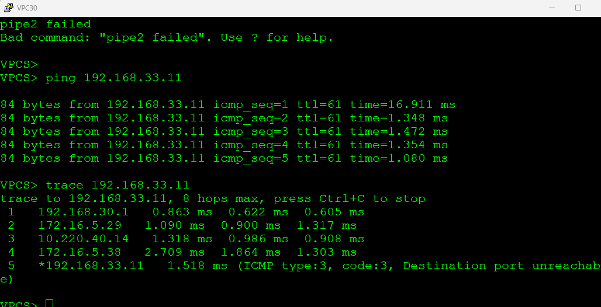
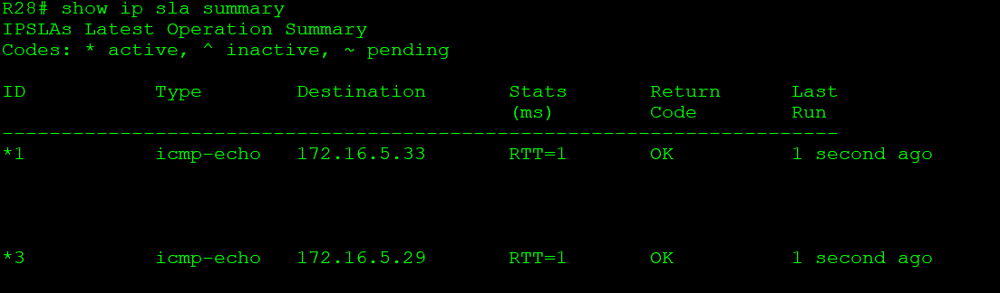
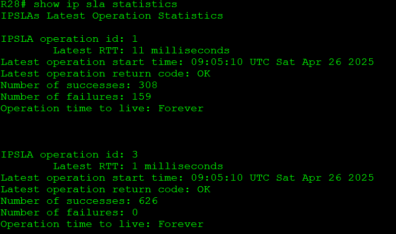
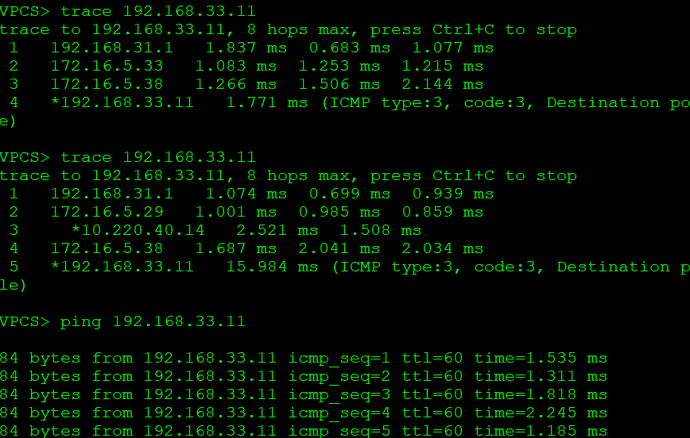
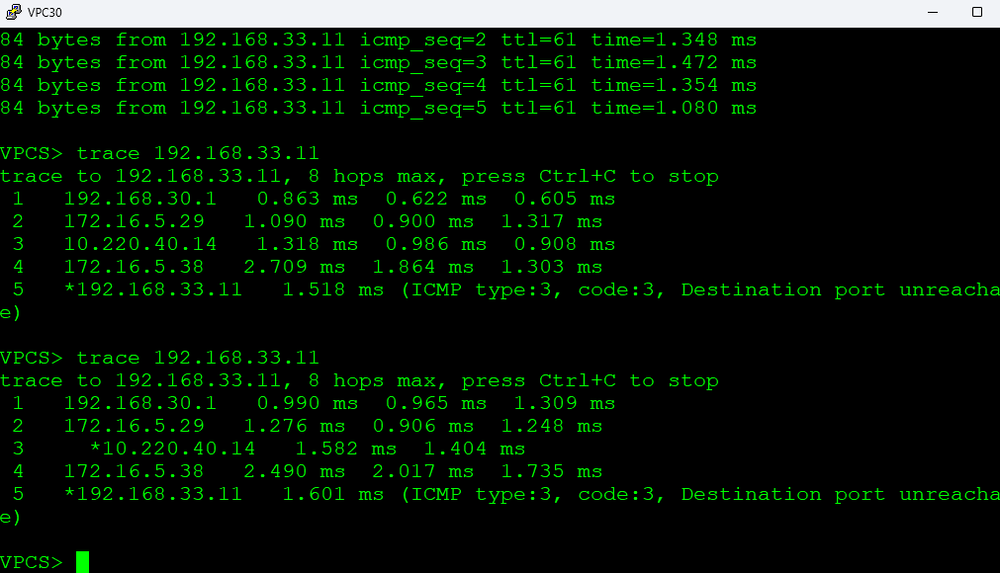
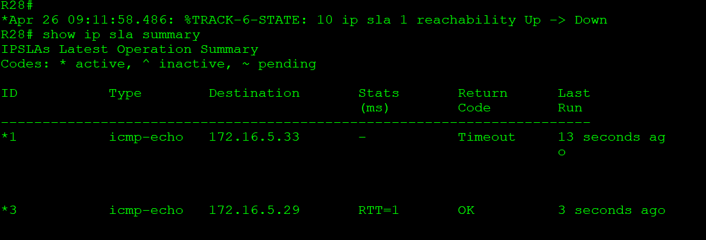
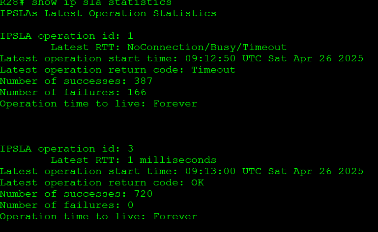

PBR

Цель:
Настроить политику маршрутизации в офисе Чокурдах.

Распределить трафик между 2 линками

Описание/Пошаговая инструкция выполнения домашнего задания:
В этой самостоятельной работе мы ожидаем, что вы самостоятельно:

1. Настроите политику маршрутизации для сетей офиса.
2. Распределите трафик между двумя линками с провайдером.
3. Настроите отслеживание линка через технологию IP SLA.(только для IPv4)
4. Настройте для офиса Лабытнанги маршрут по-умолчанию.
5. План работы и изменения зафиксированы в документации.

Схема участка сети.

1.  Настраиваем политику маршрутизации для сетей офиса
- разрешаем  сетевой трафик для адреса VPC30 192.168.30.0 и маски 0.0.0.255 для любых узлов. Аналогично для 192.168.31.0 -сеть VPC31
<pre><code>
ip access-list extended VPC30
 permit ip 192.168.30.0 0.0.0.255 any

ip access-list extended VPC31
 permit ip 192.168.31.0 0.0.0.255 any
</code></pre>

- Настроим отслеживание IP SLA для линка в сторону R25. 

Каждые 5 секунд будет проверяться ip соседство посредством пинга icmp. Правило sla 1 будет работать бесконечно, и запускается немедленно.
<pre><code>
ip sla 1
 icmp-echo 172.16.5.33 source-ip 172.16.5.34
 frequency 5
ip sla schedule 1 life forever start-time now
</code></pre>
Аналогично проверяется линк в сторону R26
<pre><code>
ip sla 3
 icmp-echo 172.16.5.29 source-ip 172.16.5.30
 frequency 5
ip sla schedule 3 life forever start-time now
</code></pre>
 Создаем Track, который отслеживает состояние операции SLA, если от IP адреса нет откликов на пинг, трек отключится и начнет работать когда SLA начнет получать пинг ответ. Track 10 отслеживает доступность R25, Track 30 -R26
<pre><code>
track 10 ip sla 1 reachability
track 30 ip sla 3 reachability
</code></pre>

- Создаем route-map для разделения трафика между линками и отслеживания состояния соединения через TRACK.

route-map TO_R26 - работает для подсети VPC30 и устанавливает next-hop приоритнее в сторону R26- при его доступности по Track 30, а  при недоступности переключается на маршрут в сторону R25 (172.16.5.33 20 track 10)

Для подсети VPC31 работает другой route-map с обратным приоритетом.

<pre><code>
route-map TO_R26 permit 10
 match ip address VPC30
 match interface Ethernet0/2.30
 set ip next-hop verify-availability 172.16.5.29 10 track 30
 set ip next-hop verify-availability 172.16.5.33 20 track 10

route-map TO_R25 permit 10
 match ip address VPC31
 match interface Ethernet0/2.31
 set ip next-hop verify-availability 172.16.5.33 10 track 10
 set ip next-hop verify-availability 172.16.5.29 20 track 30
</code></pre>

-  Привязываем политики к сабинтерфесам в сторону SW29-> VPC30+VPC31
<pre><code>
interface Ethernet0/2.30
 encapsulation dot1Q 30
 ip address 192.168.30.1 255.255.255.0
 ip policy route-map TO_R26

interface Ethernet0/2.31
 encapsulation dot1Q 31
 ip address 192.168.31.1 255.255.255.0
 ip policy route-map TO_R25
</code></pre>

- Прописывет маршрут по умолчани Лабытнанги -R27 в сторону R25

<pre><code>ip route 0.0.0.0 0.0.0.0 172.16.5.37 </code></pre>

Проверка настроек.

 Поскольку пинговать за пределами Чокурдах пока в схеме нечего, временно подключим к R27 тестовый ПК-VPC, с тестовым IP 192.168.33.11, со стороны R27 на порту e0/1 192.168.33.10. 
 <pre><code>
 interface Ethernet0/1
 ip address 192.168.33.10 255.255.255.0 </code></pre>

 Также пропишем статику на R25 и R26  для подсетей 192.168.33.0/24, 192.168.31.0/24, 192.168.30.0/24
 R25
 <pre><code>ip route 0.0.0.0 0.0.0.0 Ethernet0/2
ip route 192.168.30.0 255.255.255.0 Ethernet0/3
ip route 192.168.31.0 255.255.255.0 Ethernet0/3
ip route 192.168.33.0 255.255.255.0 Ethernet0/1</code></pre>

Пингуем и делаем трассировку от VPC31 в сторону тестового VPC, обращаем внимание - трафик идет разными маршрутами

состояние SLA на R28 в этот момент

Проверяем переключение- отключаем порт e0/3 на R25
Проверям пинг и состояние SLA

состояние SLA на R28 в этот момент

Фиксируем- что для VPC31 маршрут изменился, VPC30 - остался неизменным

- [конфигурация узлов](conf/)