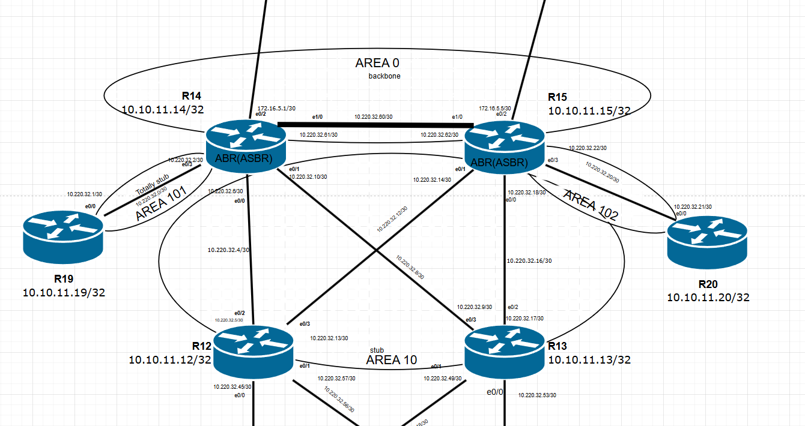

Домашнее задание
OSPF

Цель:
Настроить OSPF офисе Москва
Разделить сеть на зоны
Настроить фильтрацию между зонами

Описание/Пошаговая инструкция выполнения домашнего задания:
1. Маршрутизаторы R14-R15 находятся в зоне 0 - backbone.
2. Маршрутизаторы R12-R13 находятся в зоне 10. Дополнительно к маршрутам должны получать маршрут по умолчанию.
3. Маршрутизатор R19 находится в зоне 101 и получает только маршрут по умолчанию.
4. Маршрутизатор R20 находится в зоне 102 и получает все маршруты, кроме маршрутов до сетей зоны 101.
5. Настройка для IPv6 повторяет логику IPv4.
6. План работы и изменения зафиксированы в документации.

 Схема участка сети 
 
 
1. Маршрутизаторы R14-R15 находятся в зоне 0 - backbone. Зона bacbone должна быть неразывной, поэтому сделаем соединение между R14 и R15. Пропишем ip адреса на иниерфейсах, сразу добавляем их в Area 0

R14
<pre><code>
interface Ethernet1/0
 description R14_to_R15
 ip address 10.220.32.61 255.255.255.252
 ip ospf 1 area 0
 </code></pre>
R15
<pre><code>
interface Ethernet1/0
 description R15_to_R14
 ip address 10.220.32.62 255.255.255.252
 ip ospf 1 area 0
</code></pre>

2. Маршрутизаторы R12-R13 находятся в зоне 10. Дополнительно к маршрутам должны получать маршрут по умолчанию. Под эти условия попадает Stub area
 Пропишем R12 R13, добавляем в 10 зону Loopback и сети интерфесов.

 R12 
<pre><code>
router ospf 1
 router-id 10.10.11.12
 area 10 stub
 network 10.10.11.12 0.0.0.0 area 10
 network 10.220.32.4 0.0.0.3 area 10
 network 10.220.32.12 0.0.0.3 area 10
 network 10.220.32.44 0.0.0.3 area 10
 network 10.220.32.56 0.0.0.3 area 10
</code></pre>
 R13
 <pre><code>router ospf 1
 router-id 10.10.11.13
 area 10 stub
 network 10.10.11.13 0.0.0.0 area 10
 network 10.220.32.8 0.0.0.3 area 10
 network 10.220.32.16 0.0.0.3 area 10
 network 10.220.32.48 0.0.0.3 area 10
 network 10.220.32.52 0.0.0.3 area 10</code></pre>

3. Маршрутизатор R19 находится в зоне 101 и получает только маршрут по умолчанию. Этому условию соотвествует Totally stub area

прописываем R19
<pre><code>router ospf 1
 router-id 10.10.11.19
 area 101 stub no-summary
 network 10.10.11.19 0.0.0.0 area 101
 network 10.220.32.0 0.0.0.3 area 101</code></pre>

4.  Маршрутизатор R20 находится в зоне 102 и получает все маршруты, кроме маршрутов до сетей зоны 101. R20 находится в normal area, необходимо настроить фильтрацию маршрутов зоны 101. Фильтацию производим на маршрутизаторе R15
