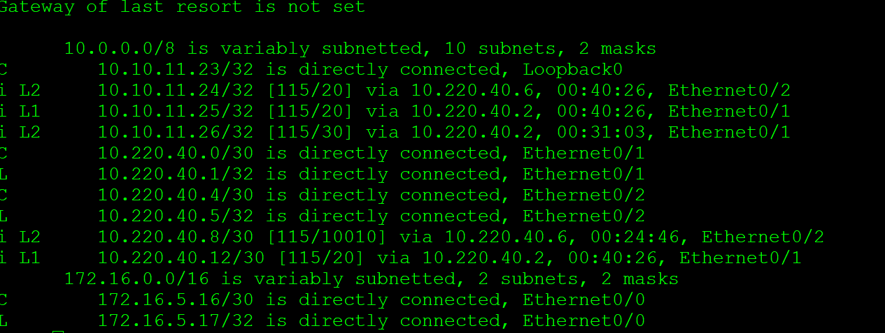
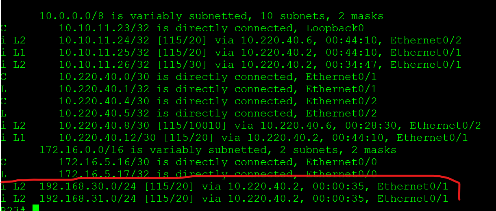
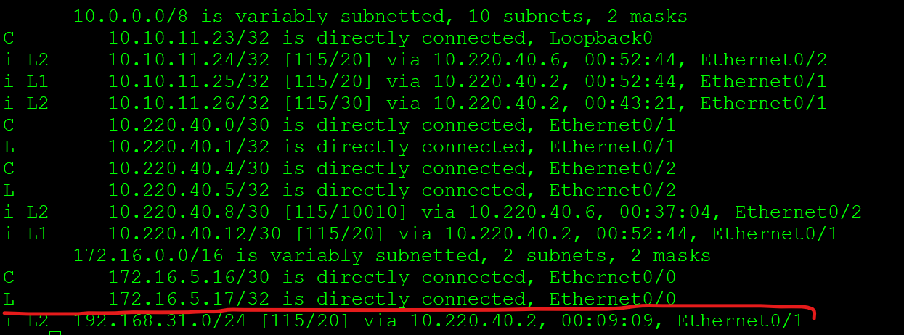
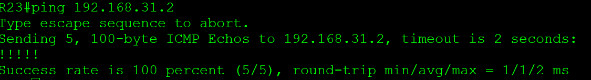

###### **IS-IS проверка работы**
[эскперементальная часть(для себя)](1/ "не жми")
проверка редистрибуции и фильтрации
пропинговать с R23 VPC31 при этом VPC30 не должен быть виден

прописываю статитику на R26 для VPC30 VPC31
 <pre><code>
ip route 192.168.30.0 255.255.255.0 Ethernet0/1

ip route 192.168.31.0 255.255.255.0 Ethernet0/1
</code></pre>
таблица маршрутизации на R23

делаем редистрибуцию всей статики на R26 в ISIS

<pre><code>
R26(config)#router isis
R26(config-router)# redistribute static
</code></pre>

таблица маршрутизации на R23 появились сети VPC31 VPC30

настроим фильрацию R26 

сначала префикс лист, где выделяем сеть VPC31
затем карта маршрутизации где разрешаем сеть из префикс листа, остальные сети по умолчанию запрещются.

 <pre><code>
!
ip prefix-list VPC31 seq 1 permit 192.168.31.0/24
!
route-map VPC31_to_ISIS permit 10
 match ip address prefix-list VPC31
!
</code></pre>
теперь делаем редистрибуцию с фильтрацией в процесс ISIS
<pre><code>
R26(config)#router isis
R26(config-router)redistribute static ip route-map VPC31_to_ISIS
</code></pre>

проверяем R23 - сеть VPC30 исчезла

пинг до VPC31 успешно

