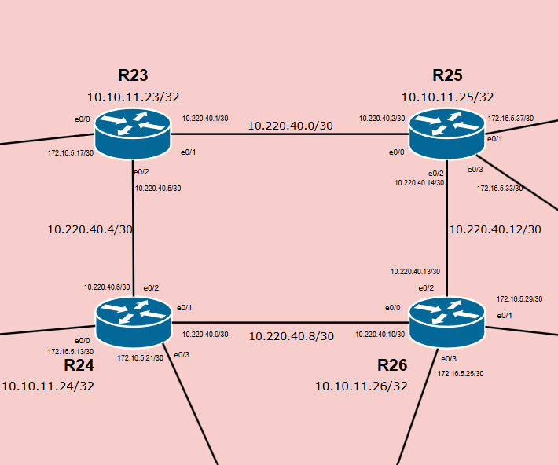
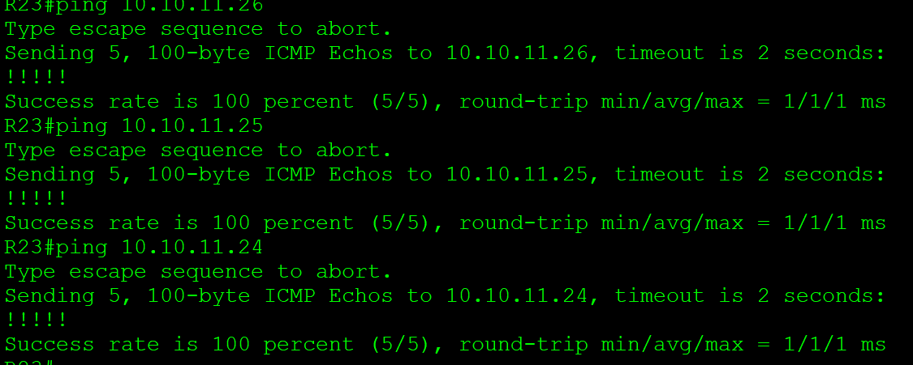
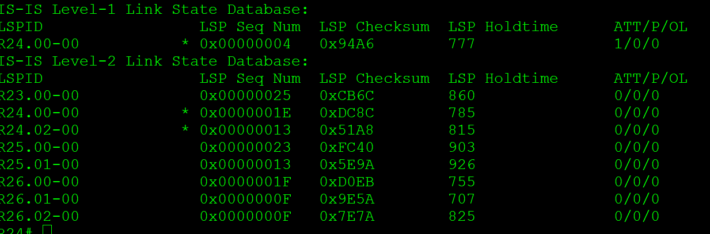
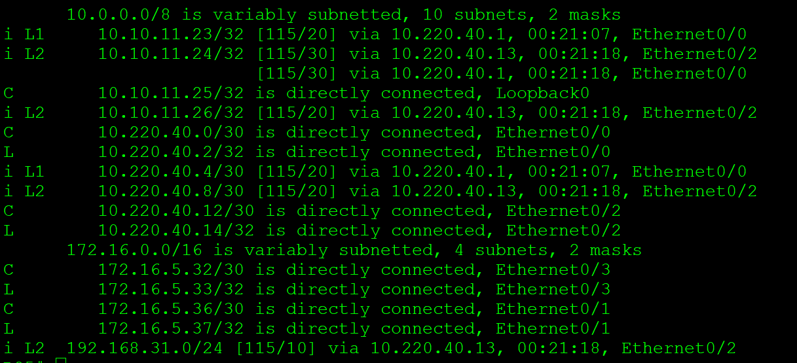
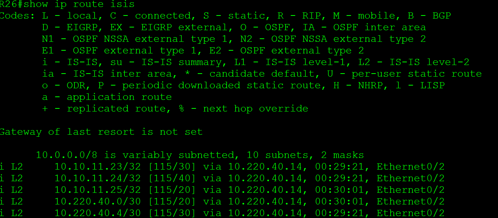

# **IS-IS**
________________________________________________________

Цель:
Настроить IS-IS офисе Триада

Описание/Пошаговая инструкция выполнения домашнего задания:
1. Настроите IS-IS в ISP Триада.
2. R23 и R25 находятся в зоне 2222.
3. R24 находится в зоне 24.
4. R26 находится в зоне 26.
5. Настройка осуществляется одновременно для IPv4 и IPv6.

Документация оформлена на github. (желательно использовать markdown).
Если нужна помощь - пишите через ЛК с помощью кнопки "чат с преподавателем" или в канал в Telegram.
 Схема участка сети

&nbsp;&nbsp;&nbsp;&nbsp;&nbsp;&nbsp;&nbsp;&nbsp;&nbsp;&nbsp;&nbsp;&nbsp;&nbsp;&nbsp;&nbsp;&nbsp;&nbsp;&nbsp;&nbsp;&nbsp;&nbsp;&nbsp;&nbsp;  &nbsp;&nbsp;&nbsp;&nbsp;&nbsp;&nbsp;&nbsp;&nbsp;&nbsp;&nbsp;
 
1. Поскольку сеть триада является транизитной,  для отказоустойчивости и масшатбируемости все маршрутизаторы будут L1-2.
2. пример настройки R23 

<pre><code>
 router isis
 net 49.2222.0100.1001.1023.00
 is-type level-1-2

 interface Ethernet0/1
 description R23_to_R25
 ip address 10.220.40.1 255.255.255.252
 ip router isis 
 isis circuit-type level-1-2

interface Ethernet0/2
 description R23_to_R24
 ip address 10.220.40.5 255.255.255.252
 ip router isis
 isis circuit-type level-1-2

interface Loopback0
 ip address 10.10.11.23 255.255.255.255
 ip router isis
 isis circuit-type level-1-2
</code></pre>
Аналогично прописываем R25.

3. На R24 в процесс ISIS прописываем net 49.0024
<pre><code>
router isis
 net 49.0024.0100.1001.1024.00
 is-type level-1-2
</code></pre>
4. На R26 в процесс ISIS прописываем net 49.0026
<pre><code>
router isis
 net 49.0026.0100.1001.1026.00
 is-type level-1-2
</code></pre>

проверяем работу ISIS

R23

R24

R25

R26

 [конфигурация узлов](conf/)

