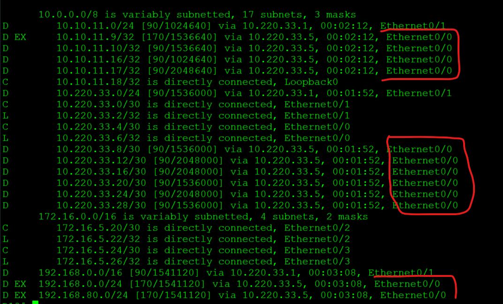

# **EIGRP**
________________________________________________________

Цель:
Настроить EIGRP в С.-Петербург;
Использовать named EIGRP

Описание/Пошаговая инструкция выполнения домашнего задания:
1. В офисе С.-Петербург настроить EIGRP.
2. R32 получает только маршрут по умолчанию.
3. R16-17 анонсируют только суммарные префиксы.
4. Использовать EIGRP named-mode для настройки сети.

 Схема участка сети

&nbsp;&nbsp;&nbsp;&nbsp;&nbsp;&nbsp;&nbsp;&nbsp;&nbsp;&nbsp;&nbsp;&nbsp;&nbsp;&nbsp;&nbsp;&nbsp;&nbsp;&nbsp;&nbsp;&nbsp;&nbsp;&nbsp;&nbsp;&nbsp;&nbsp;&nbsp;&nbsp;&nbsp;
 
1. Настройки named EIGRP на примере R18.

Задаем имя EIGRP процесса
<pre><code>
router eigrp BUBLIK
 </code></pre>
 Входим в режим настройки семейства адресов IPv4
 <pre><code>
 address-family ipv4 unicast autonomous-system 777
 </code></pre>
Включаем в данный экземпляр eigrp сети интерфесов к R16 R17
  <pre><code>
  network 10.220.33.0 0.0.0.3
  network 10.220.33.4 0.0.0.3
 
 </code></pre>

2. Для передачи в сторону R32 только default маршрута при настройке EIGRP на R16 используем суммаризацию с анонсированием только default.
  <pre><code>af-interface Ethernet0/3
   summary-address 0.0.0.0 0.0.0.0 </code></pre>
проверяем работу:

до включения суммарного маршрута. Таблица маршрутизации на R32

 

включаем, проверяем

3. Передаем только суммарные маршруты на R16 в сторону R18
 <pre><code> af-interface Ethernet0/0
   summary-address 10.10.11.0 255.255.255.0
   summary-address 10.220.33.0 255.255.255.0
   summary-address 192.168.0.0 255.255.0.0</code></pre>

проверяем
до суммаризации

 

включаем, проверяем

пингуем VPC со стороны R18

полная настройка EIGRP на R16, R17
<pre><code>
router eigrp BUBLIK
 !
 address-family ipv4 unicast autonomous-system 777
  !
  af-interface Ethernet0/3
   summary-address 0.0.0.0 0.0.0.0
  exit-af-interface
  !
  af-interface Ethernet0/1
   summary-address 10.10.11.0 255.255.255.0
   summary-address 10.220.33.0 255.255.255.0
   summary-address 192.168.0.0 255.255.0.0
  exit-af-interface
  !
  af-interface Ethernet0/0
   summary-address 10.10.11.0 255.255.255.0
   summary-address 10.220.33.0 255.255.255.0
   summary-address 192.168.0.0 255.255.0.0
  exit-af-interface
  !
  af-interface Ethernet0/2
   summary-address 10.10.11.0 255.255.255.0
   summary-address 10.220.33.0 255.255.255.0
   summary-address 192.168.0.0 255.255.0.0
  exit-af-interface
  !
  topology base
  exit-af-topology
  network 10.10.11.17 0.0.0.0
  network 10.220.33.4 0.0.0.3
  network 10.220.33.8 0.0.0.3
  network 10.220.33.20 0.0.0.3
  network 10.220.33.28 0.0.0.3
 exit-address-family</code></pre>

 [конфигурация узлов](conf/)