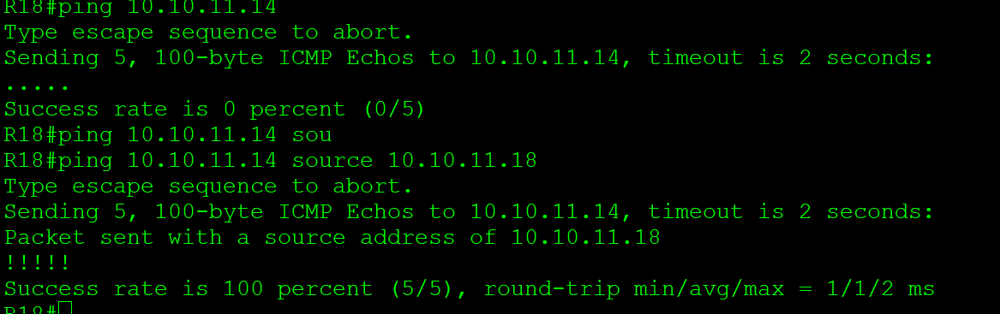
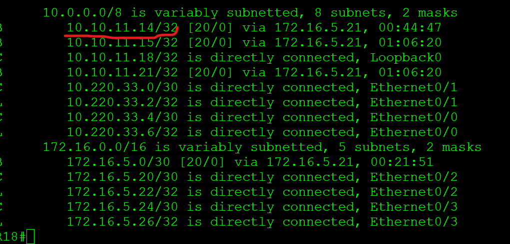
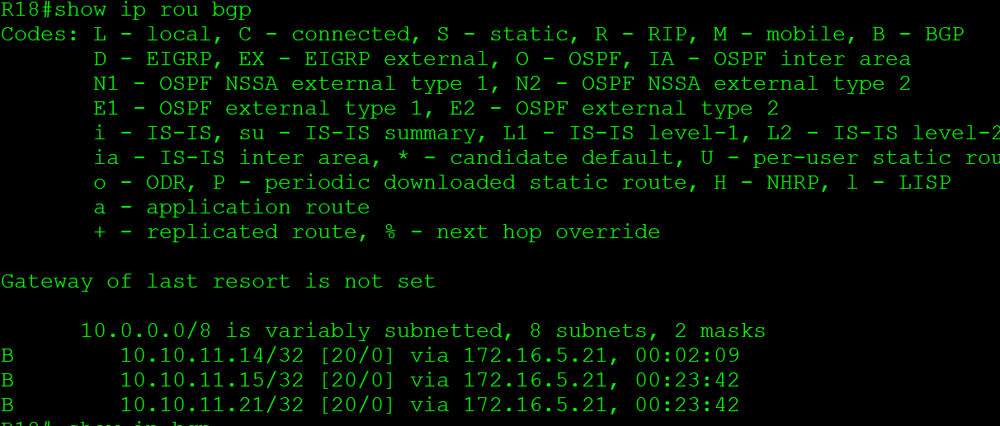
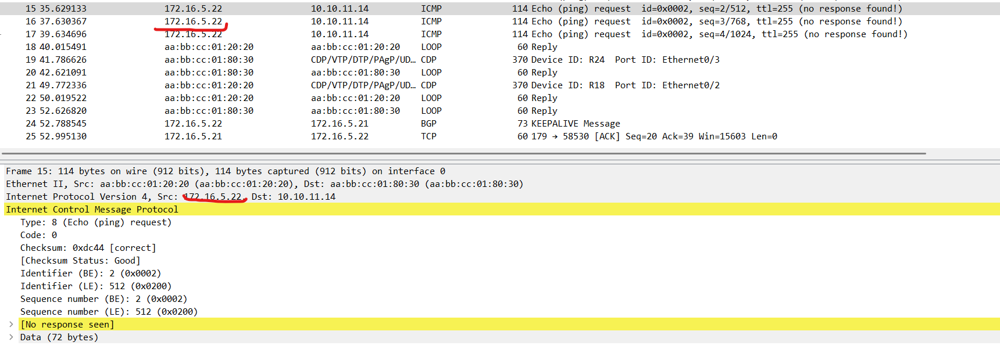
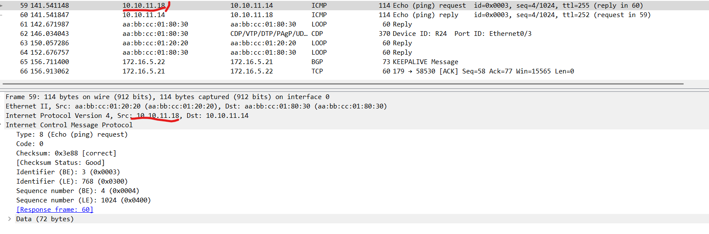
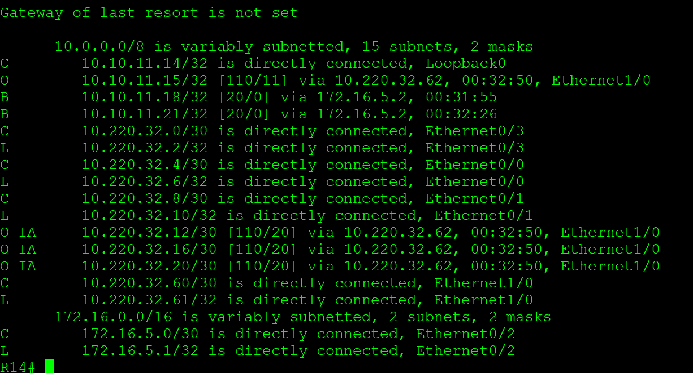
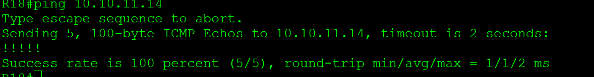
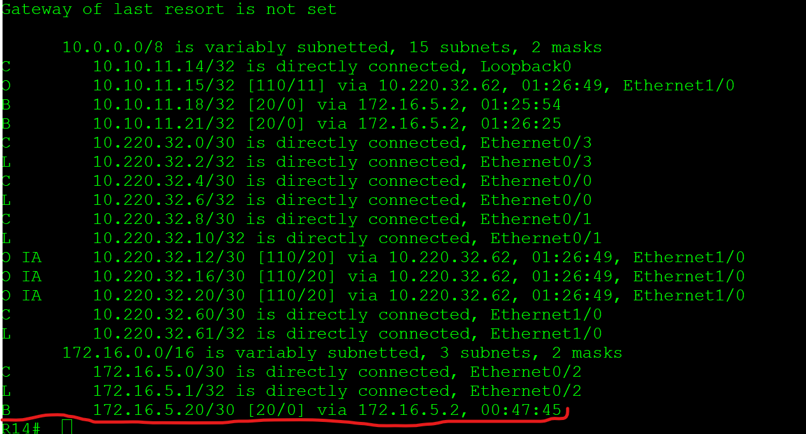

# **BGP**
________________________________________________________
Настроить BGP между автономными системами
Организовать доступность между офисами Москва и С.-Петербург

1. Настроите eBGP между офисом Москва и двумя провайдерами - Киторн и Ламас.
2. Настроите eBGP между провайдерами Киторн и Ламас.
3. Настроите eBGP между Ламас и Триада.
4. Настроите eBGP между офисом С.-Петербург и провайдером Триада.
5. Организуете IP доступность между пограничным роутерами офисами Москва и С.-Петербург.
6. План работы и изменения зафиксированы в документации.

&nbsp;&nbsp;&nbsp;&nbsp;&nbsp;&nbsp;&nbsp;&nbsp;&nbsp;&nbsp;&nbsp;&nbsp;&nbsp;&nbsp;&nbsp;&nbsp;&nbsp;&nbsp;&nbsp;&nbsp;
 
1. начальные настройки BGP на примере R14 В сторону Киторн
<pre><code>
router bgp 1001
  neighbor 172.16.5.2 remote-as 101
</code></pre>

Настраиваем  BGP на R22
<pre><code>router bgp 101
 neighbor 172.16.5.1 remote-as 1001
 neighbor 172.16.5.9 remote-as 301
 neighbor 172.16.5.17 remote-as 520</code></pre>

проверяем таблицу BGP после настройки на всех маршрутизаторах

проверяем связность со стороны R18 в сторону R14

loopback R14 пингуется только с сурсом, несмотря на то что в таблице маршрутизации сеть loo R14 есть

проверяем через Wireshark
пинг без сурс

пинг с сурс

В таблице маршрутизации R14 нет маршрута к ip 172.16.5.22 интерфейса источника эхо запроса, поэтому пингуется только после смены source на адрес loo R18

добавим сеть интерфейса e0/2 на R18 в BGP, насстройки BGP на R18 теперь 
<pre><code>router bgp 2042
 bgp log-neighbor-changes
 network 10.10.11.18 mask 255.255.255.255
 network 172.16.5.20 mask 255.255.255.252
 neighbor 172.16.5.21 remote-as 520
 neighbor 172.16.5.25 remote-as 520</code></pre>

Проверяем доступность R14

таблица маршрутизации на R14

к
 [конфигурация узлов](conf/)